Lab 11: Behavioral-based SSF Models: Hidden Markov Model based state
dependence
================
Jesse Whittington and Mark Hebblewhite
April 10, 2023

``` r
#function to install and load required packages
ipak <- function(pkg){
  new.pkg <- pkg[!(pkg %in% installed.packages()[, "Package"])]
  if (length(new.pkg)) 
    install.packages(new.pkg, dependencies = TRUE)
  sapply(pkg, require, character.only = TRUE)
}

packages <- c("tidyr","ggplot2","dplyr","stringr","lubridate","purrr","sf","terra","rgdal","maptools","readxl","amt","moveHMM","sjPlot","ggsci")

#run function to install packages
ipak(packages)
```

## Broad Settings

``` r
options(stringsAsFactors=FALSE)
crs.11 <- 26911         # EPSG:26911  UTM Zone 11 N, NAD 83
crs.latlong <- 4326     # EPSG:4326   LatLong
crs.sp.11 <- CRS("+proj=utm +zone=11 +ellps=GRS80 +datum=NAD83 +units=m")  # used by older sp package (which amt uses)
```

## 1.Import and Inspect Data

``` r
load('Data/Data 00 GPS Data.RData')
head(gps)
```

    ##        species  id           date.time       date.time.mst      x       y  sex
    ## 1 grizzly bear 122 2012-05-01 00:00:00 2012-04-30 23:00:00 573291 5679729 male
    ## 2 grizzly bear 122 2012-05-01 02:00:00 2012-05-01 01:00:00 573293 5679710 male
    ## 3 grizzly bear 122 2012-05-01 04:30:00 2012-05-01 03:30:00 573306 5679732 male
    ## 4 grizzly bear 122 2012-05-01 06:30:00 2012-05-01 05:30:00 573301 5679665 male
    ## 5 grizzly bear 122 2012-05-01 10:01:00 2012-05-01 09:01:00 577479 5679053 male
    ## 6 grizzly bear 122 2012-05-01 12:01:00 2012-05-01 11:01:00 581106 5676895 male
    ##   region_pack Month season night dt.min
    ## 1   bowvalley     5 spring     1     NA
    ## 2   bowvalley     5 spring     1    120
    ## 3   bowvalley     5 spring     1    150
    ## 4   bowvalley     5 spring     0    120
    ## 5   bowvalley     5 spring     0    211
    ## 6   bowvalley     5 spring     0    120

``` r
table(gps$species)
```

    ## 
    ## grizzly bear         wolf 
    ##        72904        85466

``` r
unique(gps$id)
```

    ##  [1] "122"  "125"  "126"  "128"  "130"  "131"  "132"  "133"  "134"  "135" 
    ## [11] "136"  "138"  "140"  "141"  "142"  "143"  "144"  "148"  "149"  "155" 
    ## [21] "156"  "158"  "160"  "161"  "30"   "34"   "45"   "56"   "59"   "64"  
    ## [31] "68"   "69"   "70"   "72"   "1101" "1201" "1203" "1501" "1503" "1504"
    ## [41] "1505" "1506" "1702" "1801" "1802" "1803" "1901" "1902" "1903" "1904"
    ## [51] "2001" "42"   "65"   "77"   "78"   "79"   "80"   "801"  "81"   "82"  
    ## [61] "83"   "84"   "85"   "86"   "87"   "902"

``` r
ggplot(gps, aes(x, y, colour = species)) +geom_point()
```

<!-- -->

``` r
### Query out just some grizzly bear data from 1 season
#table(gps$ID)
#table(gps$season)
#gpsGriz <- gps %>% filter(species == "grizzly bear")
#gpsGriz2 <- gpsGriz %>%filter(season == "summer")
#table(gpsGriz$species, gpsGriz$season)
```

Process gps data and calculate night/day, delta in time, and calculate
hours in the cosine of radians - we will see what this does below.

``` r
gps.1 <- gps %>% mutate(ID = paste(species, id), .before = date.time) 
gps.1 <- gps.1 %>% mutate(Hour = hour(date.time.mst), Min = minute(date.time.mst)) %>% 
  mutate(Hour.d = Hour + (Min / 60)) %>% 
  mutate(hour.rad = Hour.d * 2 * pi /24) %>% 
  mutate(night.cos = cos(hour.rad)) %>% 
  dplyr::select(-c(Hour, Hour.d, hour.rad, Min))
head(gps.1)
```

    ##        species  id               ID           date.time       date.time.mst
    ## 1 grizzly bear 122 grizzly bear 122 2012-05-01 00:00:00 2012-04-30 23:00:00
    ## 2 grizzly bear 122 grizzly bear 122 2012-05-01 02:00:00 2012-05-01 01:00:00
    ## 3 grizzly bear 122 grizzly bear 122 2012-05-01 04:30:00 2012-05-01 03:30:00
    ## 4 grizzly bear 122 grizzly bear 122 2012-05-01 06:30:00 2012-05-01 05:30:00
    ## 5 grizzly bear 122 grizzly bear 122 2012-05-01 10:01:00 2012-05-01 09:01:00
    ## 6 grizzly bear 122 grizzly bear 122 2012-05-01 12:01:00 2012-05-01 11:01:00
    ##        x       y  sex region_pack Month season night dt.min  night.cos
    ## 1 573291 5679729 male   bowvalley     5 spring     1     NA  0.9659258
    ## 2 573293 5679710 male   bowvalley     5 spring     1    120  0.9659258
    ## 3 573306 5679732 male   bowvalley     5 spring     1    150  0.6087614
    ## 4 573301 5679665 male   bowvalley     5 spring     0    120  0.1305262
    ## 5 577479 5679053 male   bowvalley     5 spring     0    211 -0.7101854
    ## 6 581106 5676895 male   bowvalley     5 spring     0    120 -0.9670459

``` r
## interpreting hours in radians
hour = hour(gps.1$date.time.mst)
min = minute(gps.1$date.time.mst)
hour.d = hour + (min/60)
hour.rad = hour.d * 2 * pi /24
night.cos = cos(hour.rad)
plot(night.cos, hour.d)
```

<!-- -->

``` r
## so 0.0 = about 6 and 18 hour. -1 is noon, 1 is midnight.

## Add an index, i = 1... n for each ID within each species
gps.1 <- gps.1 %>%  arrange(species, ID, date.time) %>% 
  mutate(i = 1:n()) %>% 
  mutate(species = as.character(species), season = as.character(season))
head(gps.1)
```

    ##        species  id               ID           date.time       date.time.mst
    ## 1 grizzly bear 122 grizzly bear 122 2012-05-01 00:00:00 2012-04-30 23:00:00
    ## 2 grizzly bear 122 grizzly bear 122 2012-05-01 02:00:00 2012-05-01 01:00:00
    ## 3 grizzly bear 122 grizzly bear 122 2012-05-01 04:30:00 2012-05-01 03:30:00
    ## 4 grizzly bear 122 grizzly bear 122 2012-05-01 06:30:00 2012-05-01 05:30:00
    ## 5 grizzly bear 122 grizzly bear 122 2012-05-01 10:01:00 2012-05-01 09:01:00
    ## 6 grizzly bear 122 grizzly bear 122 2012-05-01 12:01:00 2012-05-01 11:01:00
    ##        x       y  sex region_pack Month season night dt.min  night.cos i
    ## 1 573291 5679729 male   bowvalley     5 spring     1     NA  0.9659258 1
    ## 2 573293 5679710 male   bowvalley     5 spring     1    120  0.9659258 2
    ## 3 573306 5679732 male   bowvalley     5 spring     1    150  0.6087614 3
    ## 4 573301 5679665 male   bowvalley     5 spring     0    120  0.1305262 4
    ## 5 577479 5679053 male   bowvalley     5 spring     0    211 -0.7101854 5
    ## 6 581106 5676895 male   bowvalley     5 spring     0    120 -0.9670459 6

``` r
## Create a dataframe (tibble) for each speciesXseason combination
df.species.season <- gps.1 %>% group_by(species, season) %>% 
  summarise() %>% 
  ungroup() %>% 
  mutate(xxx = 1:n(), .before = species)
```

    ## `summarise()` has grouped output by 'species'. You can override using the
    ## `.groups` argument.

``` r
n.data = nrow(df.species.season)
df.species.season
```

    ## # A tibble: 7 × 3
    ##     xxx species      season
    ##   <int> <chr>        <chr> 
    ## 1     1 grizzly bear fall  
    ## 2     2 grizzly bear spring
    ## 3     3 grizzly bear summer
    ## 4     4 wolf         fall  
    ## 5     5 wolf         spring
    ## 6     6 wolf         summer
    ## 7     7 wolf         winter

``` r
# link tibble with previous datset (gps.1) by speciesXseason combination
gps.2 <- inner_join(df.species.season, gps.1, by = c('species', 'season'))
head(gps.2)
```

    ## # A tibble: 6 × 16
    ##     xxx species      season id    ID     date.time           date.time.mst      
    ##   <int> <chr>        <chr>  <chr> <chr>  <dttm>              <dttm>             
    ## 1     1 grizzly bear fall   122   grizz… 2012-09-01 00:00:00 2012-08-31 23:00:00
    ## 2     1 grizzly bear fall   122   grizz… 2012-09-01 02:00:00 2012-09-01 01:00:00
    ## 3     1 grizzly bear fall   122   grizz… 2012-09-01 04:00:00 2012-09-01 03:00:00
    ## 4     1 grizzly bear fall   122   grizz… 2012-09-01 06:00:00 2012-09-01 05:00:00
    ## 5     1 grizzly bear fall   122   grizz… 2012-09-01 08:00:00 2012-09-01 07:00:00
    ## 6     1 grizzly bear fall   122   grizz… 2012-09-01 10:00:00 2012-09-01 09:00:00
    ## # ℹ 9 more variables: x <dbl>, y <dbl>, sex <chr>, region_pack <chr>,
    ## #   Month <dbl>, night <dbl>, dt.min <dbl>, night.cos <dbl>, i <int>

``` r
data.list <- vector(mode = 'list', length = n.data)
move.list <- vector(mode = 'list', length = n.data)
```

## 2. Prepare the data for moveHMM:prepData

Select a subset of data from this table for each j - seasonXspecies
combination - (i, ID, x, y, etc), convert XY to kilometers, filter out
missed locations (dt.min is finite), then pass to moveHMM

### Key moveHMM functions

\-`moveHMM::prepData` -`fitHMM` -`plotStationary`

``` r
data.list <- vector(mode = 'list', length = n.data)
move.list <- vector(mode = 'list', length = n.data)
```

``` r
for (j in 1:n.data){
  print(df.species.season[j,])
  tmp <- gps.2 %>% filter(xxx == j)
  tmp <- tmp %>% dplyr::select(i, ID, x, y, dt.min, night.cos) %>% 
    mutate(x = x/1000, y = y/1000) %>% 
    mutate(dt.min = ifelse(is.finite(dt.min), dt.min, 1000))
  tmp <- as.data.frame(tmp)
  tmp.move <- moveHMM::prepData(tmp, type="UTM") #, coordNames=c("x","y"))  # class moveData

 
  #plot(tmp.move, compact = TRUE)  # moveHMM::plot.moveData
  tmp.move$step = ifelse(is.finite(tmp.move$step) & tmp.move$step == 0, 0.001, tmp.move$step)
  tmp.move$step = ifelse(tmp.move$dt.min > 150, NA, tmp.move$step)                       # constrain model to two hour step lengths
  tmp.move$angle = ifelse(tmp.move$dt.min > 150, NA, tmp.move$angle)   
  
  #summary(as.data.frame(tmp.move))
  #hist(tmp.move$step)
  ## initial parameters for gamma and von Mises distributions
  mu0 <- c(0.1, 1) # step mean (two parameters: one for each state) in km
  sigma0 <- c(0.1, 1) # step SD
  zeromass0 <- c(0.1,0.05) # step zero-mass.   # for negative bionmial if have zero length steps
  stepPar0 <- c(mu0, sigma0) #,zeromass0)
  angleMean0 <- c(pi, 0) # angle mean
  kappa0 <- c(1,1) # angle concentration
  anglePar0 <- c(angleMean0, kappa0)
  ## call to fitting function
  m <- fitHMM(data=tmp.move, nbStates=2, stepPar0=stepPar0,  anglePar0=anglePar0, formula = ~ night.cos) 
  plotStationary(m, plotCI = TRUE)
  m
  state.p <- stateProbs(m)
  #head(state.p)
  tmp2 <- tmp %>% mutate(step = tmp.move$step, angle = tmp.move$angle, p1 = state.p[ ,1], p2 = state.p[ ,2]) %>% 
    dplyr::select(-dt.min, - night.cos, -x, -y)
  move.list[[j]] <- m
  data.list[[j]] <- tmp2
  
}
```

    ## # A tibble: 1 × 3
    ##     xxx species      season
    ##   <int> <chr>        <chr> 
    ## 1     1 grizzly bear fall

<!-- -->

    ## # A tibble: 1 × 3
    ##     xxx species      season
    ##   <int> <chr>        <chr> 
    ## 1     2 grizzly bear spring

<!-- -->

    ## # A tibble: 1 × 3
    ##     xxx species      season
    ##   <int> <chr>        <chr> 
    ## 1     3 grizzly bear summer

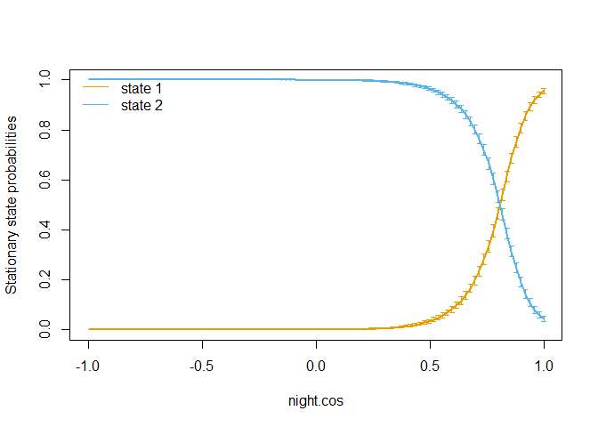<!-- -->

    ## # A tibble: 1 × 3
    ##     xxx species season
    ##   <int> <chr>   <chr> 
    ## 1     4 wolf    fall

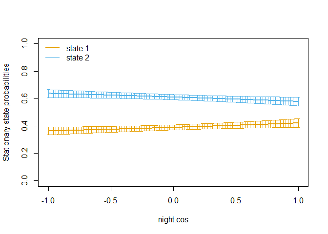<!-- -->

    ## # A tibble: 1 × 3
    ##     xxx species season
    ##   <int> <chr>   <chr> 
    ## 1     5 wolf    spring

<!-- -->

    ## # A tibble: 1 × 3
    ##     xxx species season
    ##   <int> <chr>   <chr> 
    ## 1     6 wolf    summer

<!-- -->

    ## # A tibble: 1 × 3
    ##     xxx species season
    ##   <int> <chr>   <chr> 
    ## 1     7 wolf    winter

<!-- -->

These plots show the probability of being in each of the 2 states (fast,
slow) as a function of the cosine of time of day. 0 =

``` r
par(mfrow = c(1,1))
par(ask=F)
summary(as.data.frame(tmp.move))
```

    ##       ID                 step            angle              x        
    ##  Length:41036       Min.   : 0.001   Min.   :-3.142   Min.   :522.8  
    ##  Class :character   1st Qu.: 0.016   1st Qu.:-1.486   1st Qu.:585.7  
    ##  Mode  :character   Median : 0.145   Median : 0.016   Median :595.9  
    ##                     Mean   : 1.083   Mean   : 0.019   Mean   :594.8  
    ##                     3rd Qu.: 1.396   3rd Qu.: 1.537   3rd Qu.:603.8  
    ##                     Max.   :58.983   Max.   : 3.142   Max.   :640.9  
    ##                     NA's   :3516     NA's   :3718                    
    ##        y              i              dt.min           night.cos         
    ##  Min.   :5622   Min.   : 72905   Min.   :   116.6   Min.   :-1.0000000  
    ##  1st Qu.:5674   1st Qu.: 92605   1st Qu.:   119.8   1st Qu.:-0.7071068  
    ##  Median :5710   Median :111350   Median :   120.0   Median : 0.0000000  
    ##  Mean   :5702   Mean   :112727   Mean   :   169.4   Mean   :-0.0003015  
    ##  3rd Qu.:5727   3rd Qu.:131852   3rd Qu.:   120.4   3rd Qu.: 0.7071068  
    ##  Max.   :5764   Max.   :158356   Max.   :359760.0   Max.   : 1.0000000  
    ## 

``` r
hist(tmp.move$step)
```

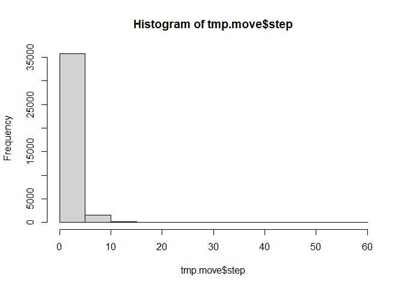<!-- -->

``` r
## More moveHMM Plots
#par(mfrow = c(1,1))
#plot(tmp.move) #being weird 
#plot(tmp.move, compact = TRUE) #being weird


tmp3 <- bind_rows(data.list)
gps.3 <- inner_join(gps.2, tmp3, by = c('i', 'ID'))
gps.3 <- gps.3 %>%  arrange(ID, date.time) %>% 
  mutate(p1 = round(p1, 3), p2 = round(p2, 3),
         step = round(step, 3), angle = round(angle, 3))

gps <- gps.3
str(gps)
```

    ## tibble [158,370 × 20] (S3: tbl_df/tbl/data.frame)
    ##  $ xxx          : int [1:158370] 2 2 2 2 2 2 2 2 2 2 ...
    ##  $ species      : chr [1:158370] "grizzly bear" "grizzly bear" "grizzly bear" "grizzly bear" ...
    ##  $ season       : chr [1:158370] "spring" "spring" "spring" "spring" ...
    ##  $ id           : chr [1:158370] "122" "122" "122" "122" ...
    ##  $ ID           : chr [1:158370] "grizzly bear 122" "grizzly bear 122" "grizzly bear 122" "grizzly bear 122" ...
    ##  $ date.time    : POSIXct[1:158370], format: "2012-05-01 00:00:00" "2012-05-01 02:00:00" ...
    ##  $ date.time.mst: POSIXct[1:158370], format: "2012-04-30 23:00:00" "2012-05-01 01:00:00" ...
    ##  $ x            : num [1:158370] 573291 573293 573306 573301 577479 ...
    ##  $ y            : num [1:158370] 5679729 5679710 5679732 5679665 5679053 ...
    ##  $ sex          : chr [1:158370] "male" "male" "male" "male" ...
    ##  $ region_pack  : chr [1:158370] "bowvalley" "bowvalley" "bowvalley" "bowvalley" ...
    ##  $ Month        : num [1:158370] 5 5 5 5 5 5 5 5 5 5 ...
    ##  $ night        : num [1:158370] 1 1 1 0 0 0 0 0 0 0 ...
    ##  $ dt.min       : num [1:158370] NA 120 150 120 211 120 119 120 122 155 ...
    ##  $ night.cos    : num [1:158370] 0.966 0.966 0.609 0.131 -0.71 ...
    ##  $ i            : int [1:158370] 1 2 3 4 5 6 7 8 9 10 ...
    ##  $ step         : num [1:158370] NA 0.026 0.067 4.223 NA ...
    ##  $ angle        : num [1:158370] NA 2.5 -2.68 1.5 NA ...
    ##  $ p1           : num [1:158370] 1 0.997 0.958 0 0.024 0 0 0.003 0 0.157 ...
    ##  $ p2           : num [1:158370] 0 0.003 0.042 1 0.976 1 1 0.997 1 0.843 ...

``` r
#save(gps, animal, juvenile, df.species.season, move.list, file = 'Data 01 GPS DataMoveState.RData')
```

## Exploring Behavioral States

``` r
par(mfrow = c(1,1))
str(gps)
```

    ## tibble [158,370 × 20] (S3: tbl_df/tbl/data.frame)
    ##  $ xxx          : int [1:158370] 2 2 2 2 2 2 2 2 2 2 ...
    ##  $ species      : chr [1:158370] "grizzly bear" "grizzly bear" "grizzly bear" "grizzly bear" ...
    ##  $ season       : chr [1:158370] "spring" "spring" "spring" "spring" ...
    ##  $ id           : chr [1:158370] "122" "122" "122" "122" ...
    ##  $ ID           : chr [1:158370] "grizzly bear 122" "grizzly bear 122" "grizzly bear 122" "grizzly bear 122" ...
    ##  $ date.time    : POSIXct[1:158370], format: "2012-05-01 00:00:00" "2012-05-01 02:00:00" ...
    ##  $ date.time.mst: POSIXct[1:158370], format: "2012-04-30 23:00:00" "2012-05-01 01:00:00" ...
    ##  $ x            : num [1:158370] 573291 573293 573306 573301 577479 ...
    ##  $ y            : num [1:158370] 5679729 5679710 5679732 5679665 5679053 ...
    ##  $ sex          : chr [1:158370] "male" "male" "male" "male" ...
    ##  $ region_pack  : chr [1:158370] "bowvalley" "bowvalley" "bowvalley" "bowvalley" ...
    ##  $ Month        : num [1:158370] 5 5 5 5 5 5 5 5 5 5 ...
    ##  $ night        : num [1:158370] 1 1 1 0 0 0 0 0 0 0 ...
    ##  $ dt.min       : num [1:158370] NA 120 150 120 211 120 119 120 122 155 ...
    ##  $ night.cos    : num [1:158370] 0.966 0.966 0.609 0.131 -0.71 ...
    ##  $ i            : int [1:158370] 1 2 3 4 5 6 7 8 9 10 ...
    ##  $ step         : num [1:158370] NA 0.026 0.067 4.223 NA ...
    ##  $ angle        : num [1:158370] NA 2.5 -2.68 1.5 NA ...
    ##  $ p1           : num [1:158370] 1 0.997 0.958 0 0.024 0 0 0.003 0 0.157 ...
    ##  $ p2           : num [1:158370] 0 0.003 0.042 1 0.976 1 1 0.997 1 0.843 ...

``` r
ggplot(gps, aes(night.cos, p1, colour = species)) +geom_point() + facet_wrap(night ~ . )
```

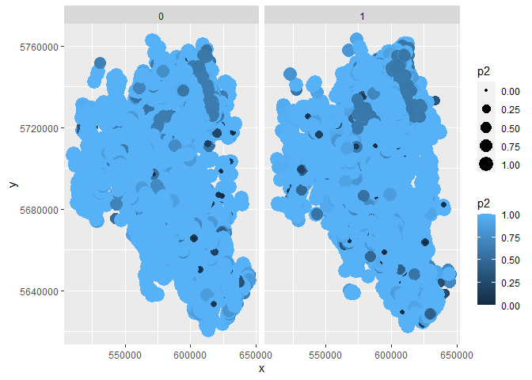<!-- -->

``` r
ggplot(gps, aes(log(step), p1, colour = species)) + stat_smooth(method="glm", method.args = list(family="binomial")) + facet_wrap(night ~ . )
```

    ## `geom_smooth()` using formula = 'y ~ x'

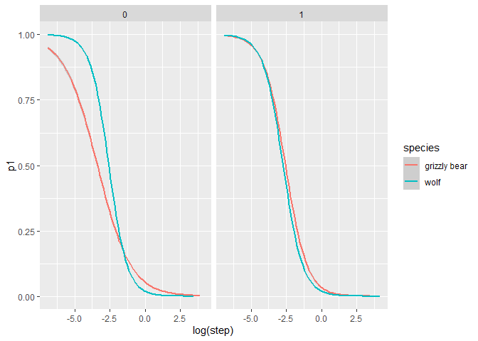<!-- -->

``` r
ggplot(gps, aes(log(step), p2, colour = species)) + stat_smooth(method="glm", method.args = list(family="binomial")) + facet_wrap(night ~ . )
```

    ## `geom_smooth()` using formula = 'y ~ x'

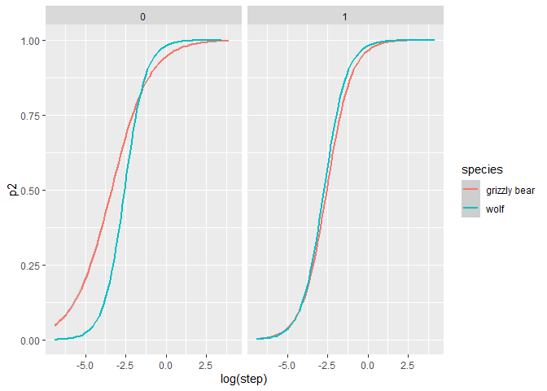<!-- -->

## So Behavioral state 2 is FAST, and behavioral state 1 is SLOW

``` r
ggplot(gps, aes(x, y, colour = p2, size = p2)) + geom_point() + facet_wrap(night ~ . )
```

<!-- -->

## SSF Movement Behavior Summarization and Preparation for SSF models

``` r
# Quick function for summarization
simpleCap <- function(x) {          
  tmp <- sapply(x, function(xxxx){
    s <- strsplit(xxxx, " ")[[1]]
    paste(toupper(substring(s, 1,1)), substring(s, 2), sep="", collapse=" ")
  })  # end of sapply
  return(tmp)
}

## Step lengths by behavioral stats by species
b0 <- gps %>% filter(is.finite(step) & step < 15) %>% mutate(state = ifelse(p1 >= 0.5, '1. Slow', '2. Fast'))
b <- b0  %>% 
  group_by(species, state) %>% 
  summarise(step.median = median(step, na.rm = TRUE), .groups = 'drop')
b
```

    ## # A tibble: 4 × 3
    ##   species      state   step.median
    ##   <chr>        <chr>         <dbl>
    ## 1 grizzly bear 1. Slow       0.016
    ## 2 grizzly bear 2. Fast       0.496
    ## 3 wolf         1. Slow       0.016
    ## 4 wolf         2. Fast       1.27

``` r
## Plot of SLs
ggplot(b0, aes(step)) +
  facet_wrap(species ~ state, scales = 'free') +
  geom_histogram(fill = 'lightblue')
```

    ## `stat_bin()` using `bins = 30`. Pick better value with `binwidth`.

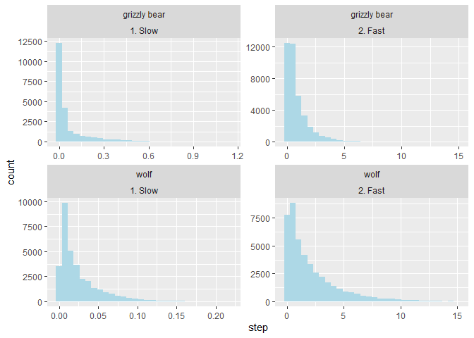<!-- -->

``` r
## Make a data frame with these summaries by species
df.species.season <- df.species.season %>% mutate(species = simpleCap(species), season = simpleCap(season))
```

### 2a. Extract parameters

``` r
result.list <- vector(mode = 'list', length = nrow(df.species.season))
for (xxx in 1:nrow(df.species.season)){
  print(xxx)
  m <- move.list[[xxx]]
  m.ci <- CI(m)
  df.list <- vector(mode = 'list', length = 4) # List to hold parameter estimates
  # Step Length
  m1 <- m$mle$stepPar
  m1.ci <- m.ci$stepPar
  
  m1.tb <- tibble(Group = 'Movement Parameter', Parameter = 'Step Length Mean', State = c('Slow', 'Fast'), 
                  Estimate = m1[1, ], lcl = m1.ci$lower[1, ], ucl = m1.ci$upper[2, ])
  m2.tb <- tibble(Group = 'Movement Parameter', Parameter = 'Step Length SD', State = c('Slow', 'Fast'), 
                  Estimate = m1[2, ], lcl = m1.ci$lower[2, ], ucl = m1.ci$upper[2, ])
  df.list[[1]] <- bind_rows(m1.tb, m2.tb)
  
  # Turn Angle
  m1 <- m$mle$anglePar
  m1.ci <- m.ci$anglePar
  
  m1.tb <- tibble(Group = 'Movement Parameter', Parameter = 'Turn Angle Mean', State = c('Slow', 'Fast'), 
                  Estimate = m1[1, ], lcl = m1.ci$lower[1, ], ucl = m1.ci$upper[2, ])
  m2.tb <- tibble(Group = 'Movement Parameter', Parameter = 'Turn Angle Concentration', State = c('Slow', 'Fast'), 
                  Estimate = m1[2, ], lcl = m1.ci$lower[2, ], ucl = m1.ci$upper[2, ])
  df.list[[2]] <- bind_rows(m1.tb, m2.tb)
 
  
  # Regression Coeffiencts for transition probabilities
  
  m1 <- m$mle$beta
  m1.ci <- m.ci$beta
  m1.tb <- tibble(Group = 'Transition Coefficient', Parameter = 'Intercept', State = c('Slow to Fast', 'Fast to Slow'), 
                  Estimate = m1[1, ], lcl = m1.ci$lower[1, ], ucl = m1.ci$upper[2, ])
  m2.tb <- tibble(Group = 'Transition Coefficient', Parameter = 'Cosine Hour', State = c('Slow to Fast', 'Fast to Slow'), 
                  Estimate = m1[2, ], lcl = m1.ci$lower[2, ], ucl = m1.ci$upper[2, ])
  df.list[[3]] <- bind_rows(m1.tb, m2.tb)
  df <- bind_rows(df.list)
  df <- df %>% mutate(Species = '', Season = '', .before = Group)
  
  df$Species[1] <- df.species.season$species[xxx]
  df$Season[1] <- df.species.season$season[xxx]
  
  result.list[[xxx]] <- df
}
```

    ## [1] 1
    ## [1] 2
    ## [1] 3
    ## [1] 4
    ## [1] 5
    ## [1] 6
    ## [1] 7

``` r
rm(df, m, m.ci, m1, m1.ci, m1.tb, m2.tb, df.list)
```

## Confidence intervals

Now that you are convinced you have a defensible HMM, you can also get
confidence intervals for your parameter estimates `CI(m)`

``` r
m.move.tidy <- bind_rows(result.list)
m.move.tidy <- m.move.tidy %>% mutate(Estimate = sprintf("%.3f", Estimate ), lcl = sprintf("%.3f", lcl), ucl = sprintf("%.3f", ucl)) %>% 
  mutate(Estimate = gsub('NA', '', Estimate), lcl = gsub('NA', '', lcl), ucl = gsub('NA', '', ucl))

m.move.tidy <- m.move.tidy %>% dplyr::rename(LCL = lcl, UCL = ucl, Type = Group)

head(m.move.tidy)
```

    ## # A tibble: 6 × 8
    ##   Species        Season Type               Parameter  State Estimate LCL   UCL  
    ##   <chr>          <chr>  <chr>              <chr>      <chr> <chr>    <chr> <chr>
    ## 1 "Grizzly Bear" "Fall" Movement Parameter Step Leng… Slow  0.012    0.011 0.011
    ## 2 ""             ""     Movement Parameter Step Leng… Fast  0.643    0.629 0.743
    ## 3 ""             ""     Movement Parameter Step Leng… Slow  0.010    0.010 0.011
    ## 4 ""             ""     Movement Parameter Step Leng… Fast  0.726    0.709 0.743
    ## 5 ""             ""     Movement Parameter Turn Angl… Slow  3.124    3.063 0.717
    ## 6 ""             ""     Movement Parameter Turn Angl… Fast  -0.017   -0.0… 0.543

## 2b. Export Table to a word file - very cool

- using `sjPlot::tab_df()`

``` r
?tab_df()
```

    ## starting httpd help server ... done

``` r
tab_df(m.move.tidy,
       alternate.rows = TRUE, # this colors the rows
       title = "Table S1. Hidden Markov movement model parameter estimates.", #always give
       digits = 3,
       file = "Output/Table S1. Movement Model Parameters.doc")
```

<table style="border-collapse:collapse; border:none;">
<caption style="font-weight: bold; text-align:left;">
Table S1. Hidden Markov movement model parameter estimates.
</caption>
<tr>
<th style="border-top: double; text-align:center; font-style:italic; font-weight:normal; padding:0.2cm; border-bottom:1px solid black; text-align:left; ">
Species
</th>
<th style="border-top: double; text-align:center; font-style:italic; font-weight:normal; padding:0.2cm; border-bottom:1px solid black; ">
Season
</th>
<th style="border-top: double; text-align:center; font-style:italic; font-weight:normal; padding:0.2cm; border-bottom:1px solid black; ">
Type
</th>
<th style="border-top: double; text-align:center; font-style:italic; font-weight:normal; padding:0.2cm; border-bottom:1px solid black; ">
Parameter
</th>
<th style="border-top: double; text-align:center; font-style:italic; font-weight:normal; padding:0.2cm; border-bottom:1px solid black; ">
State
</th>
<th style="border-top: double; text-align:center; font-style:italic; font-weight:normal; padding:0.2cm; border-bottom:1px solid black; ">
Estimate
</th>
<th style="border-top: double; text-align:center; font-style:italic; font-weight:normal; padding:0.2cm; border-bottom:1px solid black; col7">
LCL
</th>
<th style="border-top: double; text-align:center; font-style:italic; font-weight:normal; padding:0.2cm; border-bottom:1px solid black; col8">
UCL
</th>
</tr>
<tr>
<td style=" padding:0.2cm; text-align:left; vertical-align:top; text-align:left; ">
Grizzly Bear
</td>
<td style=" padding:0.2cm; text-align:left; vertical-align:top; text-align:center; ">
Fall
</td>
<td style=" padding:0.2cm; text-align:left; vertical-align:top; text-align:center; ">
Movement Parameter
</td>
<td style=" padding:0.2cm; text-align:left; vertical-align:top; text-align:center; ">
Step Length Mean
</td>
<td style=" padding:0.2cm; text-align:left; vertical-align:top; text-align:center; ">
Slow
</td>
<td style=" padding:0.2cm; text-align:left; vertical-align:top; text-align:center; ">
0.012
</td>
<td style=" padding:0.2cm; text-align:left; vertical-align:top; text-align:center; col7">
0.011
</td>
<td style=" padding:0.2cm; text-align:left; vertical-align:top; text-align:center; col8">
0.011
</td>
</tr>
<tr>
<td style=" padding:0.2cm; text-align:left; vertical-align:top; text-align:left; background-color:#f2f2f2; ">
</td>
<td style=" padding:0.2cm; text-align:left; vertical-align:top; text-align:center; background-color:#f2f2f2; ">
</td>
<td style=" padding:0.2cm; text-align:left; vertical-align:top; text-align:center; background-color:#f2f2f2; ">
Movement Parameter
</td>
<td style=" padding:0.2cm; text-align:left; vertical-align:top; text-align:center; background-color:#f2f2f2; ">
Step Length Mean
</td>
<td style=" padding:0.2cm; text-align:left; vertical-align:top; text-align:center; background-color:#f2f2f2; ">
Fast
</td>
<td style=" padding:0.2cm; text-align:left; vertical-align:top; text-align:center; background-color:#f2f2f2; ">
0.643
</td>
<td style=" padding:0.2cm; text-align:left; vertical-align:top; text-align:center; background-color:#f2f2f2; col7">
0.629
</td>
<td style=" padding:0.2cm; text-align:left; vertical-align:top; text-align:center; background-color:#f2f2f2; col8">
0.743
</td>
</tr>
<tr>
<td style=" padding:0.2cm; text-align:left; vertical-align:top; text-align:left; ">
</td>
<td style=" padding:0.2cm; text-align:left; vertical-align:top; text-align:center; ">
</td>
<td style=" padding:0.2cm; text-align:left; vertical-align:top; text-align:center; ">
Movement Parameter
</td>
<td style=" padding:0.2cm; text-align:left; vertical-align:top; text-align:center; ">
Step Length SD
</td>
<td style=" padding:0.2cm; text-align:left; vertical-align:top; text-align:center; ">
Slow
</td>
<td style=" padding:0.2cm; text-align:left; vertical-align:top; text-align:center; ">
0.010
</td>
<td style=" padding:0.2cm; text-align:left; vertical-align:top; text-align:center; col7">
0.010
</td>
<td style=" padding:0.2cm; text-align:left; vertical-align:top; text-align:center; col8">
0.011
</td>
</tr>
<tr>
<td style=" padding:0.2cm; text-align:left; vertical-align:top; text-align:left; background-color:#f2f2f2; ">
</td>
<td style=" padding:0.2cm; text-align:left; vertical-align:top; text-align:center; background-color:#f2f2f2; ">
</td>
<td style=" padding:0.2cm; text-align:left; vertical-align:top; text-align:center; background-color:#f2f2f2; ">
Movement Parameter
</td>
<td style=" padding:0.2cm; text-align:left; vertical-align:top; text-align:center; background-color:#f2f2f2; ">
Step Length SD
</td>
<td style=" padding:0.2cm; text-align:left; vertical-align:top; text-align:center; background-color:#f2f2f2; ">
Fast
</td>
<td style=" padding:0.2cm; text-align:left; vertical-align:top; text-align:center; background-color:#f2f2f2; ">
0.726
</td>
<td style=" padding:0.2cm; text-align:left; vertical-align:top; text-align:center; background-color:#f2f2f2; col7">
0.709
</td>
<td style=" padding:0.2cm; text-align:left; vertical-align:top; text-align:center; background-color:#f2f2f2; col8">
0.743
</td>
</tr>
<tr>
<td style=" padding:0.2cm; text-align:left; vertical-align:top; text-align:left; ">
</td>
<td style=" padding:0.2cm; text-align:left; vertical-align:top; text-align:center; ">
</td>
<td style=" padding:0.2cm; text-align:left; vertical-align:top; text-align:center; ">
Movement Parameter
</td>
<td style=" padding:0.2cm; text-align:left; vertical-align:top; text-align:center; ">
Turn Angle Mean
</td>
<td style=" padding:0.2cm; text-align:left; vertical-align:top; text-align:center; ">
Slow
</td>
<td style=" padding:0.2cm; text-align:left; vertical-align:top; text-align:center; ">
3.124
</td>
<td style=" padding:0.2cm; text-align:left; vertical-align:top; text-align:center; col7">
3.063
</td>
<td style=" padding:0.2cm; text-align:left; vertical-align:top; text-align:center; col8">
0.717
</td>
</tr>
<tr>
<td style=" padding:0.2cm; text-align:left; vertical-align:top; text-align:left; background-color:#f2f2f2; ">
</td>
<td style=" padding:0.2cm; text-align:left; vertical-align:top; text-align:center; background-color:#f2f2f2; ">
</td>
<td style=" padding:0.2cm; text-align:left; vertical-align:top; text-align:center; background-color:#f2f2f2; ">
Movement Parameter
</td>
<td style=" padding:0.2cm; text-align:left; vertical-align:top; text-align:center; background-color:#f2f2f2; ">
Turn Angle Mean
</td>
<td style=" padding:0.2cm; text-align:left; vertical-align:top; text-align:center; background-color:#f2f2f2; ">
Fast
</td>
<td style=" padding:0.2cm; text-align:left; vertical-align:top; text-align:center; background-color:#f2f2f2; ">
-0.017
</td>
<td style=" padding:0.2cm; text-align:left; vertical-align:top; text-align:center; background-color:#f2f2f2; col7">
-0.068
</td>
<td style=" padding:0.2cm; text-align:left; vertical-align:top; text-align:center; background-color:#f2f2f2; col8">
0.543
</td>
</tr>
<tr>
<td style=" padding:0.2cm; text-align:left; vertical-align:top; text-align:left; ">
</td>
<td style=" padding:0.2cm; text-align:left; vertical-align:top; text-align:center; ">
</td>
<td style=" padding:0.2cm; text-align:left; vertical-align:top; text-align:center; ">
Movement Parameter
</td>
<td style=" padding:0.2cm; text-align:left; vertical-align:top; text-align:center; ">
Turn Angle Concentration
</td>
<td style=" padding:0.2cm; text-align:left; vertical-align:top; text-align:center; ">
Slow
</td>
<td style=" padding:0.2cm; text-align:left; vertical-align:top; text-align:center; ">
0.672
</td>
<td style=" padding:0.2cm; text-align:left; vertical-align:top; text-align:center; col7">
0.627
</td>
<td style=" padding:0.2cm; text-align:left; vertical-align:top; text-align:center; col8">
0.717
</td>
</tr>
<tr>
<td style=" padding:0.2cm; text-align:left; vertical-align:top; text-align:left; background-color:#f2f2f2; ">
</td>
<td style=" padding:0.2cm; text-align:left; vertical-align:top; text-align:center; background-color:#f2f2f2; ">
</td>
<td style=" padding:0.2cm; text-align:left; vertical-align:top; text-align:center; background-color:#f2f2f2; ">
Movement Parameter
</td>
<td style=" padding:0.2cm; text-align:left; vertical-align:top; text-align:center; background-color:#f2f2f2; ">
Turn Angle Concentration
</td>
<td style=" padding:0.2cm; text-align:left; vertical-align:top; text-align:center; background-color:#f2f2f2; ">
Fast
</td>
<td style=" padding:0.2cm; text-align:left; vertical-align:top; text-align:center; background-color:#f2f2f2; ">
0.516
</td>
<td style=" padding:0.2cm; text-align:left; vertical-align:top; text-align:center; background-color:#f2f2f2; col7">
0.488
</td>
<td style=" padding:0.2cm; text-align:left; vertical-align:top; text-align:center; background-color:#f2f2f2; col8">
0.543
</td>
</tr>
<tr>
<td style=" padding:0.2cm; text-align:left; vertical-align:top; text-align:left; ">
</td>
<td style=" padding:0.2cm; text-align:left; vertical-align:top; text-align:center; ">
</td>
<td style=" padding:0.2cm; text-align:left; vertical-align:top; text-align:center; ">
Transition Coefficient
</td>
<td style=" padding:0.2cm; text-align:left; vertical-align:top; text-align:center; ">
Intercept
</td>
<td style=" padding:0.2cm; text-align:left; vertical-align:top; text-align:center; ">
Slow to Fast
</td>
<td style=" padding:0.2cm; text-align:left; vertical-align:top; text-align:center; ">
-0.572
</td>
<td style=" padding:0.2cm; text-align:left; vertical-align:top; text-align:center; col7">
-0.650
</td>
<td style=" padding:0.2cm; text-align:left; vertical-align:top; text-align:center; col8">
-0.639
</td>
</tr>
<tr>
<td style=" padding:0.2cm; text-align:left; vertical-align:top; text-align:left; background-color:#f2f2f2; ">
</td>
<td style=" padding:0.2cm; text-align:left; vertical-align:top; text-align:center; background-color:#f2f2f2; ">
</td>
<td style=" padding:0.2cm; text-align:left; vertical-align:top; text-align:center; background-color:#f2f2f2; ">
Transition Coefficient
</td>
<td style=" padding:0.2cm; text-align:left; vertical-align:top; text-align:center; background-color:#f2f2f2; ">
Intercept
</td>
<td style=" padding:0.2cm; text-align:left; vertical-align:top; text-align:center; background-color:#f2f2f2; ">
Fast to Slow
</td>
<td style=" padding:0.2cm; text-align:left; vertical-align:top; text-align:center; background-color:#f2f2f2; ">
-2.689
</td>
<td style=" padding:0.2cm; text-align:left; vertical-align:top; text-align:center; background-color:#f2f2f2; col7">
-2.835
</td>
<td style=" padding:0.2cm; text-align:left; vertical-align:top; text-align:center; background-color:#f2f2f2; col8">
4.088
</td>
</tr>
<tr>
<td style=" padding:0.2cm; text-align:left; vertical-align:top; text-align:left; ">
</td>
<td style=" padding:0.2cm; text-align:left; vertical-align:top; text-align:center; ">
</td>
<td style=" padding:0.2cm; text-align:left; vertical-align:top; text-align:center; ">
Transition Coefficient
</td>
<td style=" padding:0.2cm; text-align:left; vertical-align:top; text-align:center; ">
Cosine Hour
</td>
<td style=" padding:0.2cm; text-align:left; vertical-align:top; text-align:center; ">
Slow to Fast
</td>
<td style=" padding:0.2cm; text-align:left; vertical-align:top; text-align:center; ">
-0.748
</td>
<td style=" padding:0.2cm; text-align:left; vertical-align:top; text-align:center; col7">
-0.858
</td>
<td style=" padding:0.2cm; text-align:left; vertical-align:top; text-align:center; col8">
-0.639
</td>
</tr>
<tr>
<td style=" padding:0.2cm; text-align:left; vertical-align:top; text-align:left; background-color:#f2f2f2; ">
</td>
<td style=" padding:0.2cm; text-align:left; vertical-align:top; text-align:center; background-color:#f2f2f2; ">
</td>
<td style=" padding:0.2cm; text-align:left; vertical-align:top; text-align:center; background-color:#f2f2f2; ">
Transition Coefficient
</td>
<td style=" padding:0.2cm; text-align:left; vertical-align:top; text-align:center; background-color:#f2f2f2; ">
Cosine Hour
</td>
<td style=" padding:0.2cm; text-align:left; vertical-align:top; text-align:center; background-color:#f2f2f2; ">
Fast to Slow
</td>
<td style=" padding:0.2cm; text-align:left; vertical-align:top; text-align:center; background-color:#f2f2f2; ">
3.851
</td>
<td style=" padding:0.2cm; text-align:left; vertical-align:top; text-align:center; background-color:#f2f2f2; col7">
3.615
</td>
<td style=" padding:0.2cm; text-align:left; vertical-align:top; text-align:center; background-color:#f2f2f2; col8">
4.088
</td>
</tr>
<tr>
<td style=" padding:0.2cm; text-align:left; vertical-align:top; text-align:left; ">
Grizzly Bear
</td>
<td style=" padding:0.2cm; text-align:left; vertical-align:top; text-align:center; ">
Spring
</td>
<td style=" padding:0.2cm; text-align:left; vertical-align:top; text-align:center; ">
Movement Parameter
</td>
<td style=" padding:0.2cm; text-align:left; vertical-align:top; text-align:center; ">
Step Length Mean
</td>
<td style=" padding:0.2cm; text-align:left; vertical-align:top; text-align:center; ">
Slow
</td>
<td style=" padding:0.2cm; text-align:left; vertical-align:top; text-align:center; ">
0.121
</td>
<td style=" padding:0.2cm; text-align:left; vertical-align:top; text-align:center; col7">
0.115
</td>
<td style=" padding:0.2cm; text-align:left; vertical-align:top; text-align:center; col8">
0.161
</td>
</tr>
<tr>
<td style=" padding:0.2cm; text-align:left; vertical-align:top; text-align:left; background-color:#f2f2f2; ">
</td>
<td style=" padding:0.2cm; text-align:left; vertical-align:top; text-align:center; background-color:#f2f2f2; ">
</td>
<td style=" padding:0.2cm; text-align:left; vertical-align:top; text-align:center; background-color:#f2f2f2; ">
Movement Parameter
</td>
<td style=" padding:0.2cm; text-align:left; vertical-align:top; text-align:center; background-color:#f2f2f2; ">
Step Length Mean
</td>
<td style=" padding:0.2cm; text-align:left; vertical-align:top; text-align:center; background-color:#f2f2f2; ">
Fast
</td>
<td style=" padding:0.2cm; text-align:left; vertical-align:top; text-align:center; background-color:#f2f2f2; ">
1.425
</td>
<td style=" padding:0.2cm; text-align:left; vertical-align:top; text-align:center; background-color:#f2f2f2; col7">
1.374
</td>
<td style=" padding:0.2cm; text-align:left; vertical-align:top; text-align:center; background-color:#f2f2f2; col8">
1.493
</td>
</tr>
<tr>
<td style=" padding:0.2cm; text-align:left; vertical-align:top; text-align:left; ">
</td>
<td style=" padding:0.2cm; text-align:left; vertical-align:top; text-align:center; ">
</td>
<td style=" padding:0.2cm; text-align:left; vertical-align:top; text-align:center; ">
Movement Parameter
</td>
<td style=" padding:0.2cm; text-align:left; vertical-align:top; text-align:center; ">
Step Length SD
</td>
<td style=" padding:0.2cm; text-align:left; vertical-align:top; text-align:center; ">
Slow
</td>
<td style=" padding:0.2cm; text-align:left; vertical-align:top; text-align:center; ">
0.152
</td>
<td style=" padding:0.2cm; text-align:left; vertical-align:top; text-align:center; col7">
0.144
</td>
<td style=" padding:0.2cm; text-align:left; vertical-align:top; text-align:center; col8">
0.161
</td>
</tr>
<tr>
<td style=" padding:0.2cm; text-align:left; vertical-align:top; text-align:left; background-color:#f2f2f2; ">
</td>
<td style=" padding:0.2cm; text-align:left; vertical-align:top; text-align:center; background-color:#f2f2f2; ">
</td>
<td style=" padding:0.2cm; text-align:left; vertical-align:top; text-align:center; background-color:#f2f2f2; ">
Movement Parameter
</td>
<td style=" padding:0.2cm; text-align:left; vertical-align:top; text-align:center; background-color:#f2f2f2; ">
Step Length SD
</td>
<td style=" padding:0.2cm; text-align:left; vertical-align:top; text-align:center; background-color:#f2f2f2; ">
Fast
</td>
<td style=" padding:0.2cm; text-align:left; vertical-align:top; text-align:center; background-color:#f2f2f2; ">
1.449
</td>
<td style=" padding:0.2cm; text-align:left; vertical-align:top; text-align:center; background-color:#f2f2f2; col7">
1.407
</td>
<td style=" padding:0.2cm; text-align:left; vertical-align:top; text-align:center; background-color:#f2f2f2; col8">
1.493
</td>
</tr>
<tr>
<td style=" padding:0.2cm; text-align:left; vertical-align:top; text-align:left; ">
</td>
<td style=" padding:0.2cm; text-align:left; vertical-align:top; text-align:center; ">
</td>
<td style=" padding:0.2cm; text-align:left; vertical-align:top; text-align:center; ">
Movement Parameter
</td>
<td style=" padding:0.2cm; text-align:left; vertical-align:top; text-align:center; ">
Turn Angle Mean
</td>
<td style=" padding:0.2cm; text-align:left; vertical-align:top; text-align:center; ">
Slow
</td>
<td style=" padding:0.2cm; text-align:left; vertical-align:top; text-align:center; ">
3.106
</td>
<td style=" padding:0.2cm; text-align:left; vertical-align:top; text-align:center; col7">
3.024
</td>
<td style=" padding:0.2cm; text-align:left; vertical-align:top; text-align:center; col8">
0.368
</td>
</tr>
<tr>
<td style=" padding:0.2cm; text-align:left; vertical-align:top; text-align:left; background-color:#f2f2f2; ">
</td>
<td style=" padding:0.2cm; text-align:left; vertical-align:top; text-align:center; background-color:#f2f2f2; ">
</td>
<td style=" padding:0.2cm; text-align:left; vertical-align:top; text-align:center; background-color:#f2f2f2; ">
Movement Parameter
</td>
<td style=" padding:0.2cm; text-align:left; vertical-align:top; text-align:center; background-color:#f2f2f2; ">
Turn Angle Mean
</td>
<td style=" padding:0.2cm; text-align:left; vertical-align:top; text-align:center; background-color:#f2f2f2; ">
Fast
</td>
<td style=" padding:0.2cm; text-align:left; vertical-align:top; text-align:center; background-color:#f2f2f2; ">
-0.003
</td>
<td style=" padding:0.2cm; text-align:left; vertical-align:top; text-align:center; background-color:#f2f2f2; col7">
-0.044
</td>
<td style=" padding:0.2cm; text-align:left; vertical-align:top; text-align:center; background-color:#f2f2f2; col8">
0.952
</td>
</tr>
<tr>
<td style=" padding:0.2cm; text-align:left; vertical-align:top; text-align:left; ">
</td>
<td style=" padding:0.2cm; text-align:left; vertical-align:top; text-align:center; ">
</td>
<td style=" padding:0.2cm; text-align:left; vertical-align:top; text-align:center; ">
Movement Parameter
</td>
<td style=" padding:0.2cm; text-align:left; vertical-align:top; text-align:center; ">
Turn Angle Concentration
</td>
<td style=" padding:0.2cm; text-align:left; vertical-align:top; text-align:center; ">
Slow
</td>
<td style=" padding:0.2cm; text-align:left; vertical-align:top; text-align:center; ">
0.336
</td>
<td style=" padding:0.2cm; text-align:left; vertical-align:top; text-align:center; col7">
0.305
</td>
<td style=" padding:0.2cm; text-align:left; vertical-align:top; text-align:center; col8">
0.368
</td>
</tr>
<tr>
<td style=" padding:0.2cm; text-align:left; vertical-align:top; text-align:left; background-color:#f2f2f2; ">
</td>
<td style=" padding:0.2cm; text-align:left; vertical-align:top; text-align:center; background-color:#f2f2f2; ">
</td>
<td style=" padding:0.2cm; text-align:left; vertical-align:top; text-align:center; background-color:#f2f2f2; ">
Movement Parameter
</td>
<td style=" padding:0.2cm; text-align:left; vertical-align:top; text-align:center; background-color:#f2f2f2; ">
Turn Angle Concentration
</td>
<td style=" padding:0.2cm; text-align:left; vertical-align:top; text-align:center; background-color:#f2f2f2; ">
Fast
</td>
<td style=" padding:0.2cm; text-align:left; vertical-align:top; text-align:center; background-color:#f2f2f2; ">
0.902
</td>
<td style=" padding:0.2cm; text-align:left; vertical-align:top; text-align:center; background-color:#f2f2f2; col7">
0.852
</td>
<td style=" padding:0.2cm; text-align:left; vertical-align:top; text-align:center; background-color:#f2f2f2; col8">
0.952
</td>
</tr>
<tr>
<td style=" padding:0.2cm; text-align:left; vertical-align:top; text-align:left; ">
</td>
<td style=" padding:0.2cm; text-align:left; vertical-align:top; text-align:center; ">
</td>
<td style=" padding:0.2cm; text-align:left; vertical-align:top; text-align:center; ">
Transition Coefficient
</td>
<td style=" padding:0.2cm; text-align:left; vertical-align:top; text-align:center; ">
Intercept
</td>
<td style=" padding:0.2cm; text-align:left; vertical-align:top; text-align:center; ">
Slow to Fast
</td>
<td style=" padding:0.2cm; text-align:left; vertical-align:top; text-align:center; ">
-1.785
</td>
<td style=" padding:0.2cm; text-align:left; vertical-align:top; text-align:center; col7">
-1.857
</td>
<td style=" padding:0.2cm; text-align:left; vertical-align:top; text-align:center; col8">
-0.034
</td>
</tr>
<tr>
<td style=" padding:0.2cm; text-align:left; vertical-align:top; text-align:left; background-color:#f2f2f2; ">
</td>
<td style=" padding:0.2cm; text-align:left; vertical-align:top; text-align:center; background-color:#f2f2f2; ">
</td>
<td style=" padding:0.2cm; text-align:left; vertical-align:top; text-align:center; background-color:#f2f2f2; ">
Transition Coefficient
</td>
<td style=" padding:0.2cm; text-align:left; vertical-align:top; text-align:center; background-color:#f2f2f2; ">
Intercept
</td>
<td style=" padding:0.2cm; text-align:left; vertical-align:top; text-align:center; background-color:#f2f2f2; ">
Fast to Slow
</td>
<td style=" padding:0.2cm; text-align:left; vertical-align:top; text-align:center; background-color:#f2f2f2; ">
-1.248
</td>
<td style=" padding:0.2cm; text-align:left; vertical-align:top; text-align:center; background-color:#f2f2f2; col7">
-1.339
</td>
<td style=" padding:0.2cm; text-align:left; vertical-align:top; text-align:center; background-color:#f2f2f2; col8">
1.140
</td>
</tr>
<tr>
<td style=" padding:0.2cm; text-align:left; vertical-align:top; text-align:left; ">
</td>
<td style=" padding:0.2cm; text-align:left; vertical-align:top; text-align:center; ">
</td>
<td style=" padding:0.2cm; text-align:left; vertical-align:top; text-align:center; ">
Transition Coefficient
</td>
<td style=" padding:0.2cm; text-align:left; vertical-align:top; text-align:center; ">
Cosine Hour
</td>
<td style=" padding:0.2cm; text-align:left; vertical-align:top; text-align:center; ">
Slow to Fast
</td>
<td style=" padding:0.2cm; text-align:left; vertical-align:top; text-align:center; ">
-0.123
</td>
<td style=" padding:0.2cm; text-align:left; vertical-align:top; text-align:center; col7">
-0.211
</td>
<td style=" padding:0.2cm; text-align:left; vertical-align:top; text-align:center; col8">
-0.034
</td>
</tr>
<tr>
<td style=" padding:0.2cm; text-align:left; vertical-align:top; text-align:left; background-color:#f2f2f2; ">
</td>
<td style=" padding:0.2cm; text-align:left; vertical-align:top; text-align:center; background-color:#f2f2f2; ">
</td>
<td style=" padding:0.2cm; text-align:left; vertical-align:top; text-align:center; background-color:#f2f2f2; ">
Transition Coefficient
</td>
<td style=" padding:0.2cm; text-align:left; vertical-align:top; text-align:center; background-color:#f2f2f2; ">
Cosine Hour
</td>
<td style=" padding:0.2cm; text-align:left; vertical-align:top; text-align:center; background-color:#f2f2f2; ">
Fast to Slow
</td>
<td style=" padding:0.2cm; text-align:left; vertical-align:top; text-align:center; background-color:#f2f2f2; ">
1.011
</td>
<td style=" padding:0.2cm; text-align:left; vertical-align:top; text-align:center; background-color:#f2f2f2; col7">
0.882
</td>
<td style=" padding:0.2cm; text-align:left; vertical-align:top; text-align:center; background-color:#f2f2f2; col8">
1.140
</td>
</tr>
<tr>
<td style=" padding:0.2cm; text-align:left; vertical-align:top; text-align:left; ">
Grizzly Bear
</td>
<td style=" padding:0.2cm; text-align:left; vertical-align:top; text-align:center; ">
Summer
</td>
<td style=" padding:0.2cm; text-align:left; vertical-align:top; text-align:center; ">
Movement Parameter
</td>
<td style=" padding:0.2cm; text-align:left; vertical-align:top; text-align:center; ">
Step Length Mean
</td>
<td style=" padding:0.2cm; text-align:left; vertical-align:top; text-align:center; ">
Slow
</td>
<td style=" padding:0.2cm; text-align:left; vertical-align:top; text-align:center; ">
0.013
</td>
<td style=" padding:0.2cm; text-align:left; vertical-align:top; text-align:center; col7">
0.013
</td>
<td style=" padding:0.2cm; text-align:left; vertical-align:top; text-align:center; col8">
0.012
</td>
</tr>
<tr>
<td style=" padding:0.2cm; text-align:left; vertical-align:top; text-align:left; background-color:#f2f2f2; ">
</td>
<td style=" padding:0.2cm; text-align:left; vertical-align:top; text-align:center; background-color:#f2f2f2; ">
</td>
<td style=" padding:0.2cm; text-align:left; vertical-align:top; text-align:center; background-color:#f2f2f2; ">
Movement Parameter
</td>
<td style=" padding:0.2cm; text-align:left; vertical-align:top; text-align:center; background-color:#f2f2f2; ">
Step Length Mean
</td>
<td style=" padding:0.2cm; text-align:left; vertical-align:top; text-align:center; background-color:#f2f2f2; ">
Fast
</td>
<td style=" padding:0.2cm; text-align:left; vertical-align:top; text-align:center; background-color:#f2f2f2; ">
0.801
</td>
<td style=" padding:0.2cm; text-align:left; vertical-align:top; text-align:center; background-color:#f2f2f2; col7">
0.789
</td>
<td style=" padding:0.2cm; text-align:left; vertical-align:top; text-align:center; background-color:#f2f2f2; col8">
0.919
</td>
</tr>
<tr>
<td style=" padding:0.2cm; text-align:left; vertical-align:top; text-align:left; ">
</td>
<td style=" padding:0.2cm; text-align:left; vertical-align:top; text-align:center; ">
</td>
<td style=" padding:0.2cm; text-align:left; vertical-align:top; text-align:center; ">
Movement Parameter
</td>
<td style=" padding:0.2cm; text-align:left; vertical-align:top; text-align:center; ">
Step Length SD
</td>
<td style=" padding:0.2cm; text-align:left; vertical-align:top; text-align:center; ">
Slow
</td>
<td style=" padding:0.2cm; text-align:left; vertical-align:top; text-align:center; ">
0.011
</td>
<td style=" padding:0.2cm; text-align:left; vertical-align:top; text-align:center; col7">
0.011
</td>
<td style=" padding:0.2cm; text-align:left; vertical-align:top; text-align:center; col8">
0.012
</td>
</tr>
<tr>
<td style=" padding:0.2cm; text-align:left; vertical-align:top; text-align:left; background-color:#f2f2f2; ">
</td>
<td style=" padding:0.2cm; text-align:left; vertical-align:top; text-align:center; background-color:#f2f2f2; ">
</td>
<td style=" padding:0.2cm; text-align:left; vertical-align:top; text-align:center; background-color:#f2f2f2; ">
Movement Parameter
</td>
<td style=" padding:0.2cm; text-align:left; vertical-align:top; text-align:center; background-color:#f2f2f2; ">
Step Length SD
</td>
<td style=" padding:0.2cm; text-align:left; vertical-align:top; text-align:center; background-color:#f2f2f2; ">
Fast
</td>
<td style=" padding:0.2cm; text-align:left; vertical-align:top; text-align:center; background-color:#f2f2f2; ">
0.903
</td>
<td style=" padding:0.2cm; text-align:left; vertical-align:top; text-align:center; background-color:#f2f2f2; col7">
0.887
</td>
<td style=" padding:0.2cm; text-align:left; vertical-align:top; text-align:center; background-color:#f2f2f2; col8">
0.919
</td>
</tr>
<tr>
<td style=" padding:0.2cm; text-align:left; vertical-align:top; text-align:left; ">
</td>
<td style=" padding:0.2cm; text-align:left; vertical-align:top; text-align:center; ">
</td>
<td style=" padding:0.2cm; text-align:left; vertical-align:top; text-align:center; ">
Movement Parameter
</td>
<td style=" padding:0.2cm; text-align:left; vertical-align:top; text-align:center; ">
Turn Angle Mean
</td>
<td style=" padding:0.2cm; text-align:left; vertical-align:top; text-align:center; ">
Slow
</td>
<td style=" padding:0.2cm; text-align:left; vertical-align:top; text-align:center; ">
3.140
</td>
<td style=" padding:0.2cm; text-align:left; vertical-align:top; text-align:center; col7">
3.057
</td>
<td style=" padding:0.2cm; text-align:left; vertical-align:top; text-align:center; col8">
0.582
</td>
</tr>
<tr>
<td style=" padding:0.2cm; text-align:left; vertical-align:top; text-align:left; background-color:#f2f2f2; ">
</td>
<td style=" padding:0.2cm; text-align:left; vertical-align:top; text-align:center; background-color:#f2f2f2; ">
</td>
<td style=" padding:0.2cm; text-align:left; vertical-align:top; text-align:center; background-color:#f2f2f2; ">
Movement Parameter
</td>
<td style=" padding:0.2cm; text-align:left; vertical-align:top; text-align:center; background-color:#f2f2f2; ">
Turn Angle Mean
</td>
<td style=" padding:0.2cm; text-align:left; vertical-align:top; text-align:center; background-color:#f2f2f2; ">
Fast
</td>
<td style=" padding:0.2cm; text-align:left; vertical-align:top; text-align:center; background-color:#f2f2f2; ">
-0.012
</td>
<td style=" padding:0.2cm; text-align:left; vertical-align:top; text-align:center; background-color:#f2f2f2; col7">
-0.053
</td>
<td style=" padding:0.2cm; text-align:left; vertical-align:top; text-align:center; background-color:#f2f2f2; col8">
0.495
</td>
</tr>
<tr>
<td style=" padding:0.2cm; text-align:left; vertical-align:top; text-align:left; ">
</td>
<td style=" padding:0.2cm; text-align:left; vertical-align:top; text-align:center; ">
</td>
<td style=" padding:0.2cm; text-align:left; vertical-align:top; text-align:center; ">
Movement Parameter
</td>
<td style=" padding:0.2cm; text-align:left; vertical-align:top; text-align:center; ">
Turn Angle Concentration
</td>
<td style=" padding:0.2cm; text-align:left; vertical-align:top; text-align:center; ">
Slow
</td>
<td style=" padding:0.2cm; text-align:left; vertical-align:top; text-align:center; ">
0.535
</td>
<td style=" padding:0.2cm; text-align:left; vertical-align:top; text-align:center; col7">
0.489
</td>
<td style=" padding:0.2cm; text-align:left; vertical-align:top; text-align:center; col8">
0.582
</td>
</tr>
<tr>
<td style=" padding:0.2cm; text-align:left; vertical-align:top; text-align:left; background-color:#f2f2f2; ">
</td>
<td style=" padding:0.2cm; text-align:left; vertical-align:top; text-align:center; background-color:#f2f2f2; ">
</td>
<td style=" padding:0.2cm; text-align:left; vertical-align:top; text-align:center; background-color:#f2f2f2; ">
Movement Parameter
</td>
<td style=" padding:0.2cm; text-align:left; vertical-align:top; text-align:center; background-color:#f2f2f2; ">
Turn Angle Concentration
</td>
<td style=" padding:0.2cm; text-align:left; vertical-align:top; text-align:center; background-color:#f2f2f2; ">
Fast
</td>
<td style=" padding:0.2cm; text-align:left; vertical-align:top; text-align:center; background-color:#f2f2f2; ">
0.474
</td>
<td style=" padding:0.2cm; text-align:left; vertical-align:top; text-align:center; background-color:#f2f2f2; col7">
0.454
</td>
<td style=" padding:0.2cm; text-align:left; vertical-align:top; text-align:center; background-color:#f2f2f2; col8">
0.495
</td>
</tr>
<tr>
<td style=" padding:0.2cm; text-align:left; vertical-align:top; text-align:left; ">
</td>
<td style=" padding:0.2cm; text-align:left; vertical-align:top; text-align:center; ">
</td>
<td style=" padding:0.2cm; text-align:left; vertical-align:top; text-align:center; ">
Transition Coefficient
</td>
<td style=" padding:0.2cm; text-align:left; vertical-align:top; text-align:center; ">
Intercept
</td>
<td style=" padding:0.2cm; text-align:left; vertical-align:top; text-align:center; ">
Slow to Fast
</td>
<td style=" padding:0.2cm; text-align:left; vertical-align:top; text-align:center; ">
11.739
</td>
<td style=" padding:0.2cm; text-align:left; vertical-align:top; text-align:center; col7">
10.476
</td>
<td style=" padding:0.2cm; text-align:left; vertical-align:top; text-align:center; col8">
-13.556
</td>
</tr>
<tr>
<td style=" padding:0.2cm; text-align:left; vertical-align:top; text-align:left; background-color:#f2f2f2; ">
</td>
<td style=" padding:0.2cm; text-align:left; vertical-align:top; text-align:center; background-color:#f2f2f2; ">
</td>
<td style=" padding:0.2cm; text-align:left; vertical-align:top; text-align:center; background-color:#f2f2f2; ">
Transition Coefficient
</td>
<td style=" padding:0.2cm; text-align:left; vertical-align:top; text-align:center; background-color:#f2f2f2; ">
Intercept
</td>
<td style=" padding:0.2cm; text-align:left; vertical-align:top; text-align:center; background-color:#f2f2f2; ">
Fast to Slow
</td>
<td style=" padding:0.2cm; text-align:left; vertical-align:top; text-align:center; background-color:#f2f2f2; ">
-7.963
</td>
<td style=" padding:0.2cm; text-align:left; vertical-align:top; text-align:center; background-color:#f2f2f2; col7">
-8.504
</td>
<td style=" padding:0.2cm; text-align:left; vertical-align:top; text-align:center; background-color:#f2f2f2; col8">
9.990
</td>
</tr>
<tr>
<td style=" padding:0.2cm; text-align:left; vertical-align:top; text-align:left; ">
</td>
<td style=" padding:0.2cm; text-align:left; vertical-align:top; text-align:center; ">
</td>
<td style=" padding:0.2cm; text-align:left; vertical-align:top; text-align:center; ">
Transition Coefficient
</td>
<td style=" padding:0.2cm; text-align:left; vertical-align:top; text-align:center; ">
Cosine Hour
</td>
<td style=" padding:0.2cm; text-align:left; vertical-align:top; text-align:center; ">
Slow to Fast
</td>
<td style=" padding:0.2cm; text-align:left; vertical-align:top; text-align:center; ">
-15.046
</td>
<td style=" padding:0.2cm; text-align:left; vertical-align:top; text-align:center; col7">
-16.535
</td>
<td style=" padding:0.2cm; text-align:left; vertical-align:top; text-align:center; col8">
-13.556
</td>
</tr>
<tr>
<td style=" padding:0.2cm; text-align:left; vertical-align:top; text-align:left; background-color:#f2f2f2; ">
</td>
<td style=" padding:0.2cm; text-align:left; vertical-align:top; text-align:center; background-color:#f2f2f2; ">
</td>
<td style=" padding:0.2cm; text-align:left; vertical-align:top; text-align:center; background-color:#f2f2f2; ">
Transition Coefficient
</td>
<td style=" padding:0.2cm; text-align:left; vertical-align:top; text-align:center; background-color:#f2f2f2; ">
Cosine Hour
</td>
<td style=" padding:0.2cm; text-align:left; vertical-align:top; text-align:center; background-color:#f2f2f2; ">
Fast to Slow
</td>
<td style=" padding:0.2cm; text-align:left; vertical-align:top; text-align:center; background-color:#f2f2f2; ">
9.352
</td>
<td style=" padding:0.2cm; text-align:left; vertical-align:top; text-align:center; background-color:#f2f2f2; col7">
8.714
</td>
<td style=" padding:0.2cm; text-align:left; vertical-align:top; text-align:center; background-color:#f2f2f2; col8">
9.990
</td>
</tr>
<tr>
<td style=" padding:0.2cm; text-align:left; vertical-align:top; text-align:left; ">
Wolf
</td>
<td style=" padding:0.2cm; text-align:left; vertical-align:top; text-align:center; ">
Fall
</td>
<td style=" padding:0.2cm; text-align:left; vertical-align:top; text-align:center; ">
Movement Parameter
</td>
<td style=" padding:0.2cm; text-align:left; vertical-align:top; text-align:center; ">
Step Length Mean
</td>
<td style=" padding:0.2cm; text-align:left; vertical-align:top; text-align:center; ">
Slow
</td>
<td style=" padding:0.2cm; text-align:left; vertical-align:top; text-align:center; ">
0.025
</td>
<td style=" padding:0.2cm; text-align:left; vertical-align:top; text-align:center; col7">
0.024
</td>
<td style=" padding:0.2cm; text-align:left; vertical-align:top; text-align:center; col8">
0.028
</td>
</tr>
<tr>
<td style=" padding:0.2cm; text-align:left; vertical-align:top; text-align:left; background-color:#f2f2f2; ">
</td>
<td style=" padding:0.2cm; text-align:left; vertical-align:top; text-align:center; background-color:#f2f2f2; ">
</td>
<td style=" padding:0.2cm; text-align:left; vertical-align:top; text-align:center; background-color:#f2f2f2; ">
Movement Parameter
</td>
<td style=" padding:0.2cm; text-align:left; vertical-align:top; text-align:center; background-color:#f2f2f2; ">
Step Length Mean
</td>
<td style=" padding:0.2cm; text-align:left; vertical-align:top; text-align:center; background-color:#f2f2f2; ">
Fast
</td>
<td style=" padding:0.2cm; text-align:left; vertical-align:top; text-align:center; background-color:#f2f2f2; ">
2.185
</td>
<td style=" padding:0.2cm; text-align:left; vertical-align:top; text-align:center; background-color:#f2f2f2; col7">
2.109
</td>
<td style=" padding:0.2cm; text-align:left; vertical-align:top; text-align:center; background-color:#f2f2f2; col8">
2.743
</td>
</tr>
<tr>
<td style=" padding:0.2cm; text-align:left; vertical-align:top; text-align:left; ">
</td>
<td style=" padding:0.2cm; text-align:left; vertical-align:top; text-align:center; ">
</td>
<td style=" padding:0.2cm; text-align:left; vertical-align:top; text-align:center; ">
Movement Parameter
</td>
<td style=" padding:0.2cm; text-align:left; vertical-align:top; text-align:center; ">
Step Length SD
</td>
<td style=" padding:0.2cm; text-align:left; vertical-align:top; text-align:center; ">
Slow
</td>
<td style=" padding:0.2cm; text-align:left; vertical-align:top; text-align:center; ">
0.026
</td>
<td style=" padding:0.2cm; text-align:left; vertical-align:top; text-align:center; col7">
0.024
</td>
<td style=" padding:0.2cm; text-align:left; vertical-align:top; text-align:center; col8">
0.028
</td>
</tr>
<tr>
<td style=" padding:0.2cm; text-align:left; vertical-align:top; text-align:left; background-color:#f2f2f2; ">
</td>
<td style=" padding:0.2cm; text-align:left; vertical-align:top; text-align:center; background-color:#f2f2f2; ">
</td>
<td style=" padding:0.2cm; text-align:left; vertical-align:top; text-align:center; background-color:#f2f2f2; ">
Movement Parameter
</td>
<td style=" padding:0.2cm; text-align:left; vertical-align:top; text-align:center; background-color:#f2f2f2; ">
Step Length SD
</td>
<td style=" padding:0.2cm; text-align:left; vertical-align:top; text-align:center; background-color:#f2f2f2; ">
Fast
</td>
<td style=" padding:0.2cm; text-align:left; vertical-align:top; text-align:center; background-color:#f2f2f2; ">
2.650
</td>
<td style=" padding:0.2cm; text-align:left; vertical-align:top; text-align:center; background-color:#f2f2f2; col7">
2.560
</td>
<td style=" padding:0.2cm; text-align:left; vertical-align:top; text-align:center; background-color:#f2f2f2; col8">
2.743
</td>
</tr>
<tr>
<td style=" padding:0.2cm; text-align:left; vertical-align:top; text-align:left; ">
</td>
<td style=" padding:0.2cm; text-align:left; vertical-align:top; text-align:center; ">
</td>
<td style=" padding:0.2cm; text-align:left; vertical-align:top; text-align:center; ">
Movement Parameter
</td>
<td style=" padding:0.2cm; text-align:left; vertical-align:top; text-align:center; ">
Turn Angle Mean
</td>
<td style=" padding:0.2cm; text-align:left; vertical-align:top; text-align:center; ">
Slow
</td>
<td style=" padding:0.2cm; text-align:left; vertical-align:top; text-align:center; ">
-3.111
</td>
<td style=" padding:0.2cm; text-align:left; vertical-align:top; text-align:center; col7">
-3.223
</td>
<td style=" padding:0.2cm; text-align:left; vertical-align:top; text-align:center; col8">
0.479
</td>
</tr>
<tr>
<td style=" padding:0.2cm; text-align:left; vertical-align:top; text-align:left; background-color:#f2f2f2; ">
</td>
<td style=" padding:0.2cm; text-align:left; vertical-align:top; text-align:center; background-color:#f2f2f2; ">
</td>
<td style=" padding:0.2cm; text-align:left; vertical-align:top; text-align:center; background-color:#f2f2f2; ">
Movement Parameter
</td>
<td style=" padding:0.2cm; text-align:left; vertical-align:top; text-align:center; background-color:#f2f2f2; ">
Turn Angle Mean
</td>
<td style=" padding:0.2cm; text-align:left; vertical-align:top; text-align:center; background-color:#f2f2f2; ">
Fast
</td>
<td style=" padding:0.2cm; text-align:left; vertical-align:top; text-align:center; background-color:#f2f2f2; ">
0.026
</td>
<td style=" padding:0.2cm; text-align:left; vertical-align:top; text-align:center; background-color:#f2f2f2; col7">
-0.100
</td>
<td style=" padding:0.2cm; text-align:left; vertical-align:top; text-align:center; background-color:#f2f2f2; col8">
0.337
</td>
</tr>
<tr>
<td style=" padding:0.2cm; text-align:left; vertical-align:top; text-align:left; ">
</td>
<td style=" padding:0.2cm; text-align:left; vertical-align:top; text-align:center; ">
</td>
<td style=" padding:0.2cm; text-align:left; vertical-align:top; text-align:center; ">
Movement Parameter
</td>
<td style=" padding:0.2cm; text-align:left; vertical-align:top; text-align:center; ">
Turn Angle Concentration
</td>
<td style=" padding:0.2cm; text-align:left; vertical-align:top; text-align:center; ">
Slow
</td>
<td style=" padding:0.2cm; text-align:left; vertical-align:top; text-align:center; ">
0.427
</td>
<td style=" padding:0.2cm; text-align:left; vertical-align:top; text-align:center; col7">
0.376
</td>
<td style=" padding:0.2cm; text-align:left; vertical-align:top; text-align:center; col8">
0.479
</td>
</tr>
<tr>
<td style=" padding:0.2cm; text-align:left; vertical-align:top; text-align:left; background-color:#f2f2f2; ">
</td>
<td style=" padding:0.2cm; text-align:left; vertical-align:top; text-align:center; background-color:#f2f2f2; ">
</td>
<td style=" padding:0.2cm; text-align:left; vertical-align:top; text-align:center; background-color:#f2f2f2; ">
Movement Parameter
</td>
<td style=" padding:0.2cm; text-align:left; vertical-align:top; text-align:center; background-color:#f2f2f2; ">
Turn Angle Concentration
</td>
<td style=" padding:0.2cm; text-align:left; vertical-align:top; text-align:center; background-color:#f2f2f2; ">
Fast
</td>
<td style=" padding:0.2cm; text-align:left; vertical-align:top; text-align:center; background-color:#f2f2f2; ">
0.297
</td>
<td style=" padding:0.2cm; text-align:left; vertical-align:top; text-align:center; background-color:#f2f2f2; col7">
0.259
</td>
<td style=" padding:0.2cm; text-align:left; vertical-align:top; text-align:center; background-color:#f2f2f2; col8">
0.337
</td>
</tr>
<tr>
<td style=" padding:0.2cm; text-align:left; vertical-align:top; text-align:left; ">
</td>
<td style=" padding:0.2cm; text-align:left; vertical-align:top; text-align:center; ">
</td>
<td style=" padding:0.2cm; text-align:left; vertical-align:top; text-align:center; ">
Transition Coefficient
</td>
<td style=" padding:0.2cm; text-align:left; vertical-align:top; text-align:center; ">
Intercept
</td>
<td style=" padding:0.2cm; text-align:left; vertical-align:top; text-align:center; ">
Slow to Fast
</td>
<td style=" padding:0.2cm; text-align:left; vertical-align:top; text-align:center; ">
-0.652
</td>
<td style=" padding:0.2cm; text-align:left; vertical-align:top; text-align:center; col7">
-0.730
</td>
<td style=" padding:0.2cm; text-align:left; vertical-align:top; text-align:center; col8">
-0.196
</td>
</tr>
<tr>
<td style=" padding:0.2cm; text-align:left; vertical-align:top; text-align:left; background-color:#f2f2f2; ">
</td>
<td style=" padding:0.2cm; text-align:left; vertical-align:top; text-align:center; background-color:#f2f2f2; ">
</td>
<td style=" padding:0.2cm; text-align:left; vertical-align:top; text-align:center; background-color:#f2f2f2; ">
Transition Coefficient
</td>
<td style=" padding:0.2cm; text-align:left; vertical-align:top; text-align:center; background-color:#f2f2f2; ">
Intercept
</td>
<td style=" padding:0.2cm; text-align:left; vertical-align:top; text-align:center; background-color:#f2f2f2; ">
Fast to Slow
</td>
<td style=" padding:0.2cm; text-align:left; vertical-align:top; text-align:center; background-color:#f2f2f2; ">
-1.275
</td>
<td style=" padding:0.2cm; text-align:left; vertical-align:top; text-align:center; background-color:#f2f2f2; col7">
-1.358
</td>
<td style=" padding:0.2cm; text-align:left; vertical-align:top; text-align:center; background-color:#f2f2f2; col8">
0.005
</td>
</tr>
<tr>
<td style=" padding:0.2cm; text-align:left; vertical-align:top; text-align:left; ">
</td>
<td style=" padding:0.2cm; text-align:left; vertical-align:top; text-align:center; ">
</td>
<td style=" padding:0.2cm; text-align:left; vertical-align:top; text-align:center; ">
Transition Coefficient
</td>
<td style=" padding:0.2cm; text-align:left; vertical-align:top; text-align:center; ">
Cosine Hour
</td>
<td style=" padding:0.2cm; text-align:left; vertical-align:top; text-align:center; ">
Slow to Fast
</td>
<td style=" padding:0.2cm; text-align:left; vertical-align:top; text-align:center; ">
-0.306
</td>
<td style=" padding:0.2cm; text-align:left; vertical-align:top; text-align:center; col7">
-0.417
</td>
<td style=" padding:0.2cm; text-align:left; vertical-align:top; text-align:center; col8">
-0.196
</td>
</tr>
<tr>
<td style=" padding:0.2cm; text-align:left; vertical-align:top; text-align:left; background-color:#f2f2f2; ">
</td>
<td style=" padding:0.2cm; text-align:left; vertical-align:top; text-align:center; background-color:#f2f2f2; ">
</td>
<td style=" padding:0.2cm; text-align:left; vertical-align:top; text-align:center; background-color:#f2f2f2; ">
Transition Coefficient
</td>
<td style=" padding:0.2cm; text-align:left; vertical-align:top; text-align:center; background-color:#f2f2f2; ">
Cosine Hour
</td>
<td style=" padding:0.2cm; text-align:left; vertical-align:top; text-align:center; background-color:#f2f2f2; ">
Fast to Slow
</td>
<td style=" padding:0.2cm; text-align:left; vertical-align:top; text-align:center; background-color:#f2f2f2; ">
-0.100
</td>
<td style=" padding:0.2cm; text-align:left; vertical-align:top; text-align:center; background-color:#f2f2f2; col7">
-0.205
</td>
<td style=" padding:0.2cm; text-align:left; vertical-align:top; text-align:center; background-color:#f2f2f2; col8">
0.005
</td>
</tr>
<tr>
<td style=" padding:0.2cm; text-align:left; vertical-align:top; text-align:left; ">
Wolf
</td>
<td style=" padding:0.2cm; text-align:left; vertical-align:top; text-align:center; ">
Spring
</td>
<td style=" padding:0.2cm; text-align:left; vertical-align:top; text-align:center; ">
Movement Parameter
</td>
<td style=" padding:0.2cm; text-align:left; vertical-align:top; text-align:center; ">
Step Length Mean
</td>
<td style=" padding:0.2cm; text-align:left; vertical-align:top; text-align:center; ">
Slow
</td>
<td style=" padding:0.2cm; text-align:left; vertical-align:top; text-align:center; ">
0.034
</td>
<td style=" padding:0.2cm; text-align:left; vertical-align:top; text-align:center; col7">
0.033
</td>
<td style=" padding:0.2cm; text-align:left; vertical-align:top; text-align:center; col8">
0.035
</td>
</tr>
<tr>
<td style=" padding:0.2cm; text-align:left; vertical-align:top; text-align:left; background-color:#f2f2f2; ">
</td>
<td style=" padding:0.2cm; text-align:left; vertical-align:top; text-align:center; background-color:#f2f2f2; ">
</td>
<td style=" padding:0.2cm; text-align:left; vertical-align:top; text-align:center; background-color:#f2f2f2; ">
Movement Parameter
</td>
<td style=" padding:0.2cm; text-align:left; vertical-align:top; text-align:center; background-color:#f2f2f2; ">
Step Length Mean
</td>
<td style=" padding:0.2cm; text-align:left; vertical-align:top; text-align:center; background-color:#f2f2f2; ">
Fast
</td>
<td style=" padding:0.2cm; text-align:left; vertical-align:top; text-align:center; background-color:#f2f2f2; ">
2.456
</td>
<td style=" padding:0.2cm; text-align:left; vertical-align:top; text-align:center; background-color:#f2f2f2; col7">
2.384
</td>
<td style=" padding:0.2cm; text-align:left; vertical-align:top; text-align:center; background-color:#f2f2f2; col8">
3.129
</td>
</tr>
<tr>
<td style=" padding:0.2cm; text-align:left; vertical-align:top; text-align:left; ">
</td>
<td style=" padding:0.2cm; text-align:left; vertical-align:top; text-align:center; ">
</td>
<td style=" padding:0.2cm; text-align:left; vertical-align:top; text-align:center; ">
Movement Parameter
</td>
<td style=" padding:0.2cm; text-align:left; vertical-align:top; text-align:center; ">
Step Length SD
</td>
<td style=" padding:0.2cm; text-align:left; vertical-align:top; text-align:center; ">
Slow
</td>
<td style=" padding:0.2cm; text-align:left; vertical-align:top; text-align:center; ">
0.033
</td>
<td style=" padding:0.2cm; text-align:left; vertical-align:top; text-align:center; col7">
0.031
</td>
<td style=" padding:0.2cm; text-align:left; vertical-align:top; text-align:center; col8">
0.035
</td>
</tr>
<tr>
<td style=" padding:0.2cm; text-align:left; vertical-align:top; text-align:left; background-color:#f2f2f2; ">
</td>
<td style=" padding:0.2cm; text-align:left; vertical-align:top; text-align:center; background-color:#f2f2f2; ">
</td>
<td style=" padding:0.2cm; text-align:left; vertical-align:top; text-align:center; background-color:#f2f2f2; ">
Movement Parameter
</td>
<td style=" padding:0.2cm; text-align:left; vertical-align:top; text-align:center; background-color:#f2f2f2; ">
Step Length SD
</td>
<td style=" padding:0.2cm; text-align:left; vertical-align:top; text-align:center; background-color:#f2f2f2; ">
Fast
</td>
<td style=" padding:0.2cm; text-align:left; vertical-align:top; text-align:center; background-color:#f2f2f2; ">
3.038
</td>
<td style=" padding:0.2cm; text-align:left; vertical-align:top; text-align:center; background-color:#f2f2f2; col7">
2.950
</td>
<td style=" padding:0.2cm; text-align:left; vertical-align:top; text-align:center; background-color:#f2f2f2; col8">
3.129
</td>
</tr>
<tr>
<td style=" padding:0.2cm; text-align:left; vertical-align:top; text-align:left; ">
</td>
<td style=" padding:0.2cm; text-align:left; vertical-align:top; text-align:center; ">
</td>
<td style=" padding:0.2cm; text-align:left; vertical-align:top; text-align:center; ">
Movement Parameter
</td>
<td style=" padding:0.2cm; text-align:left; vertical-align:top; text-align:center; ">
Turn Angle Mean
</td>
<td style=" padding:0.2cm; text-align:left; vertical-align:top; text-align:center; ">
Slow
</td>
<td style=" padding:0.2cm; text-align:left; vertical-align:top; text-align:center; ">
3.065
</td>
<td style=" padding:0.2cm; text-align:left; vertical-align:top; text-align:center; col7">
2.996
</td>
<td style=" padding:0.2cm; text-align:left; vertical-align:top; text-align:center; col8">
0.588
</td>
</tr>
<tr>
<td style=" padding:0.2cm; text-align:left; vertical-align:top; text-align:left; background-color:#f2f2f2; ">
</td>
<td style=" padding:0.2cm; text-align:left; vertical-align:top; text-align:center; background-color:#f2f2f2; ">
</td>
<td style=" padding:0.2cm; text-align:left; vertical-align:top; text-align:center; background-color:#f2f2f2; ">
Movement Parameter
</td>
<td style=" padding:0.2cm; text-align:left; vertical-align:top; text-align:center; background-color:#f2f2f2; ">
Turn Angle Mean
</td>
<td style=" padding:0.2cm; text-align:left; vertical-align:top; text-align:center; background-color:#f2f2f2; ">
Fast
</td>
<td style=" padding:0.2cm; text-align:left; vertical-align:top; text-align:center; background-color:#f2f2f2; ">
-0.028
</td>
<td style=" padding:0.2cm; text-align:left; vertical-align:top; text-align:center; background-color:#f2f2f2; col7">
-0.110
</td>
<td style=" padding:0.2cm; text-align:left; vertical-align:top; text-align:center; background-color:#f2f2f2; col8">
0.417
</td>
</tr>
<tr>
<td style=" padding:0.2cm; text-align:left; vertical-align:top; text-align:left; ">
</td>
<td style=" padding:0.2cm; text-align:left; vertical-align:top; text-align:center; ">
</td>
<td style=" padding:0.2cm; text-align:left; vertical-align:top; text-align:center; ">
Movement Parameter
</td>
<td style=" padding:0.2cm; text-align:left; vertical-align:top; text-align:center; ">
Turn Angle Concentration
</td>
<td style=" padding:0.2cm; text-align:left; vertical-align:top; text-align:center; ">
Slow
</td>
<td style=" padding:0.2cm; text-align:left; vertical-align:top; text-align:center; ">
0.546
</td>
<td style=" padding:0.2cm; text-align:left; vertical-align:top; text-align:center; col7">
0.504
</td>
<td style=" padding:0.2cm; text-align:left; vertical-align:top; text-align:center; col8">
0.588
</td>
</tr>
<tr>
<td style=" padding:0.2cm; text-align:left; vertical-align:top; text-align:left; background-color:#f2f2f2; ">
</td>
<td style=" padding:0.2cm; text-align:left; vertical-align:top; text-align:center; background-color:#f2f2f2; ">
</td>
<td style=" padding:0.2cm; text-align:left; vertical-align:top; text-align:center; background-color:#f2f2f2; ">
Movement Parameter
</td>
<td style=" padding:0.2cm; text-align:left; vertical-align:top; text-align:center; background-color:#f2f2f2; ">
Turn Angle Concentration
</td>
<td style=" padding:0.2cm; text-align:left; vertical-align:top; text-align:center; background-color:#f2f2f2; ">
Fast
</td>
<td style=" padding:0.2cm; text-align:left; vertical-align:top; text-align:center; background-color:#f2f2f2; ">
0.384
</td>
<td style=" padding:0.2cm; text-align:left; vertical-align:top; text-align:center; background-color:#f2f2f2; col7">
0.351
</td>
<td style=" padding:0.2cm; text-align:left; vertical-align:top; text-align:center; background-color:#f2f2f2; col8">
0.417
</td>
</tr>
<tr>
<td style=" padding:0.2cm; text-align:left; vertical-align:top; text-align:left; ">
</td>
<td style=" padding:0.2cm; text-align:left; vertical-align:top; text-align:center; ">
</td>
<td style=" padding:0.2cm; text-align:left; vertical-align:top; text-align:center; ">
Transition Coefficient
</td>
<td style=" padding:0.2cm; text-align:left; vertical-align:top; text-align:center; ">
Intercept
</td>
<td style=" padding:0.2cm; text-align:left; vertical-align:top; text-align:center; ">
Slow to Fast
</td>
<td style=" padding:0.2cm; text-align:left; vertical-align:top; text-align:center; ">
-0.867
</td>
<td style=" padding:0.2cm; text-align:left; vertical-align:top; text-align:center; col7">
-0.930
</td>
<td style=" padding:0.2cm; text-align:left; vertical-align:top; text-align:center; col8">
0.264
</td>
</tr>
<tr>
<td style=" padding:0.2cm; text-align:left; vertical-align:top; text-align:left; background-color:#f2f2f2; ">
</td>
<td style=" padding:0.2cm; text-align:left; vertical-align:top; text-align:center; background-color:#f2f2f2; ">
</td>
<td style=" padding:0.2cm; text-align:left; vertical-align:top; text-align:center; background-color:#f2f2f2; ">
Transition Coefficient
</td>
<td style=" padding:0.2cm; text-align:left; vertical-align:top; text-align:center; background-color:#f2f2f2; ">
Intercept
</td>
<td style=" padding:0.2cm; text-align:left; vertical-align:top; text-align:center; background-color:#f2f2f2; ">
Fast to Slow
</td>
<td style=" padding:0.2cm; text-align:left; vertical-align:top; text-align:center; background-color:#f2f2f2; ">
-1.312
</td>
<td style=" padding:0.2cm; text-align:left; vertical-align:top; text-align:center; background-color:#f2f2f2; col7">
-1.384
</td>
<td style=" padding:0.2cm; text-align:left; vertical-align:top; text-align:center; background-color:#f2f2f2; col8">
-0.214
</td>
</tr>
<tr>
<td style=" padding:0.2cm; text-align:left; vertical-align:top; text-align:left; ">
</td>
<td style=" padding:0.2cm; text-align:left; vertical-align:top; text-align:center; ">
</td>
<td style=" padding:0.2cm; text-align:left; vertical-align:top; text-align:center; ">
Transition Coefficient
</td>
<td style=" padding:0.2cm; text-align:left; vertical-align:top; text-align:center; ">
Cosine Hour
</td>
<td style=" padding:0.2cm; text-align:left; vertical-align:top; text-align:center; ">
Slow to Fast
</td>
<td style=" padding:0.2cm; text-align:left; vertical-align:top; text-align:center; ">
0.176
</td>
<td style=" padding:0.2cm; text-align:left; vertical-align:top; text-align:center; col7">
0.087
</td>
<td style=" padding:0.2cm; text-align:left; vertical-align:top; text-align:center; col8">
0.264
</td>
</tr>
<tr>
<td style=" padding:0.2cm; text-align:left; vertical-align:top; text-align:left; background-color:#f2f2f2; ">
</td>
<td style=" padding:0.2cm; text-align:left; vertical-align:top; text-align:center; background-color:#f2f2f2; ">
</td>
<td style=" padding:0.2cm; text-align:left; vertical-align:top; text-align:center; background-color:#f2f2f2; ">
Transition Coefficient
</td>
<td style=" padding:0.2cm; text-align:left; vertical-align:top; text-align:center; background-color:#f2f2f2; ">
Cosine Hour
</td>
<td style=" padding:0.2cm; text-align:left; vertical-align:top; text-align:center; background-color:#f2f2f2; ">
Fast to Slow
</td>
<td style=" padding:0.2cm; text-align:left; vertical-align:top; text-align:center; background-color:#f2f2f2; ">
-0.305
</td>
<td style=" padding:0.2cm; text-align:left; vertical-align:top; text-align:center; background-color:#f2f2f2; col7">
-0.395
</td>
<td style=" padding:0.2cm; text-align:left; vertical-align:top; text-align:center; background-color:#f2f2f2; col8">
-0.214
</td>
</tr>
<tr>
<td style=" padding:0.2cm; text-align:left; vertical-align:top; text-align:left; ">
Wolf
</td>
<td style=" padding:0.2cm; text-align:left; vertical-align:top; text-align:center; ">
Summer
</td>
<td style=" padding:0.2cm; text-align:left; vertical-align:top; text-align:center; ">
Movement Parameter
</td>
<td style=" padding:0.2cm; text-align:left; vertical-align:top; text-align:center; ">
Step Length Mean
</td>
<td style=" padding:0.2cm; text-align:left; vertical-align:top; text-align:center; ">
Slow
</td>
<td style=" padding:0.2cm; text-align:left; vertical-align:top; text-align:center; ">
0.036
</td>
<td style=" padding:0.2cm; text-align:left; vertical-align:top; text-align:center; col7">
0.033
</td>
<td style=" padding:0.2cm; text-align:left; vertical-align:top; text-align:center; col8">
0.041
</td>
</tr>
<tr>
<td style=" padding:0.2cm; text-align:left; vertical-align:top; text-align:left; background-color:#f2f2f2; ">
</td>
<td style=" padding:0.2cm; text-align:left; vertical-align:top; text-align:center; background-color:#f2f2f2; ">
</td>
<td style=" padding:0.2cm; text-align:left; vertical-align:top; text-align:center; background-color:#f2f2f2; ">
Movement Parameter
</td>
<td style=" padding:0.2cm; text-align:left; vertical-align:top; text-align:center; background-color:#f2f2f2; ">
Step Length Mean
</td>
<td style=" padding:0.2cm; text-align:left; vertical-align:top; text-align:center; background-color:#f2f2f2; ">
Fast
</td>
<td style=" padding:0.2cm; text-align:left; vertical-align:top; text-align:center; background-color:#f2f2f2; ">
2.242
</td>
<td style=" padding:0.2cm; text-align:left; vertical-align:top; text-align:center; background-color:#f2f2f2; col7">
2.176
</td>
<td style=" padding:0.2cm; text-align:left; vertical-align:top; text-align:center; background-color:#f2f2f2; col8">
2.807
</td>
</tr>
<tr>
<td style=" padding:0.2cm; text-align:left; vertical-align:top; text-align:left; ">
</td>
<td style=" padding:0.2cm; text-align:left; vertical-align:top; text-align:center; ">
</td>
<td style=" padding:0.2cm; text-align:left; vertical-align:top; text-align:center; ">
Movement Parameter
</td>
<td style=" padding:0.2cm; text-align:left; vertical-align:top; text-align:center; ">
Step Length SD
</td>
<td style=" padding:0.2cm; text-align:left; vertical-align:top; text-align:center; ">
Slow
</td>
<td style=" padding:0.2cm; text-align:left; vertical-align:top; text-align:center; ">
0.038
</td>
<td style=" padding:0.2cm; text-align:left; vertical-align:top; text-align:center; col7">
0.035
</td>
<td style=" padding:0.2cm; text-align:left; vertical-align:top; text-align:center; col8">
0.041
</td>
</tr>
<tr>
<td style=" padding:0.2cm; text-align:left; vertical-align:top; text-align:left; background-color:#f2f2f2; ">
</td>
<td style=" padding:0.2cm; text-align:left; vertical-align:top; text-align:center; background-color:#f2f2f2; ">
</td>
<td style=" padding:0.2cm; text-align:left; vertical-align:top; text-align:center; background-color:#f2f2f2; ">
Movement Parameter
</td>
<td style=" padding:0.2cm; text-align:left; vertical-align:top; text-align:center; background-color:#f2f2f2; ">
Step Length SD
</td>
<td style=" padding:0.2cm; text-align:left; vertical-align:top; text-align:center; background-color:#f2f2f2; ">
Fast
</td>
<td style=" padding:0.2cm; text-align:left; vertical-align:top; text-align:center; background-color:#f2f2f2; ">
2.730
</td>
<td style=" padding:0.2cm; text-align:left; vertical-align:top; text-align:center; background-color:#f2f2f2; col7">
2.655
</td>
<td style=" padding:0.2cm; text-align:left; vertical-align:top; text-align:center; background-color:#f2f2f2; col8">
2.807
</td>
</tr>
<tr>
<td style=" padding:0.2cm; text-align:left; vertical-align:top; text-align:left; ">
</td>
<td style=" padding:0.2cm; text-align:left; vertical-align:top; text-align:center; ">
</td>
<td style=" padding:0.2cm; text-align:left; vertical-align:top; text-align:center; ">
Movement Parameter
</td>
<td style=" padding:0.2cm; text-align:left; vertical-align:top; text-align:center; ">
Turn Angle Mean
</td>
<td style=" padding:0.2cm; text-align:left; vertical-align:top; text-align:center; ">
Slow
</td>
<td style=" padding:0.2cm; text-align:left; vertical-align:top; text-align:center; ">
3.107
</td>
<td style=" padding:0.2cm; text-align:left; vertical-align:top; text-align:center; col7">
3.016
</td>
<td style=" padding:0.2cm; text-align:left; vertical-align:top; text-align:center; col8">
0.516
</td>
</tr>
<tr>
<td style=" padding:0.2cm; text-align:left; vertical-align:top; text-align:left; background-color:#f2f2f2; ">
</td>
<td style=" padding:0.2cm; text-align:left; vertical-align:top; text-align:center; background-color:#f2f2f2; ">
</td>
<td style=" padding:0.2cm; text-align:left; vertical-align:top; text-align:center; background-color:#f2f2f2; ">
Movement Parameter
</td>
<td style=" padding:0.2cm; text-align:left; vertical-align:top; text-align:center; background-color:#f2f2f2; ">
Turn Angle Mean
</td>
<td style=" padding:0.2cm; text-align:left; vertical-align:top; text-align:center; background-color:#f2f2f2; ">
Fast
</td>
<td style=" padding:0.2cm; text-align:left; vertical-align:top; text-align:center; background-color:#f2f2f2; ">
0.055
</td>
<td style=" padding:0.2cm; text-align:left; vertical-align:top; text-align:center; background-color:#f2f2f2; col7">
-0.039
</td>
<td style=" padding:0.2cm; text-align:left; vertical-align:top; text-align:center; background-color:#f2f2f2; col8">
0.356
</td>
</tr>
<tr>
<td style=" padding:0.2cm; text-align:left; vertical-align:top; text-align:left; ">
</td>
<td style=" padding:0.2cm; text-align:left; vertical-align:top; text-align:center; ">
</td>
<td style=" padding:0.2cm; text-align:left; vertical-align:top; text-align:center; ">
Movement Parameter
</td>
<td style=" padding:0.2cm; text-align:left; vertical-align:top; text-align:center; ">
Turn Angle Concentration
</td>
<td style=" padding:0.2cm; text-align:left; vertical-align:top; text-align:center; ">
Slow
</td>
<td style=" padding:0.2cm; text-align:left; vertical-align:top; text-align:center; ">
0.468
</td>
<td style=" padding:0.2cm; text-align:left; vertical-align:top; text-align:center; col7">
0.421
</td>
<td style=" padding:0.2cm; text-align:left; vertical-align:top; text-align:center; col8">
0.516
</td>
</tr>
<tr>
<td style=" padding:0.2cm; text-align:left; vertical-align:top; text-align:left; background-color:#f2f2f2; ">
</td>
<td style=" padding:0.2cm; text-align:left; vertical-align:top; text-align:center; background-color:#f2f2f2; ">
</td>
<td style=" padding:0.2cm; text-align:left; vertical-align:top; text-align:center; background-color:#f2f2f2; ">
Movement Parameter
</td>
<td style=" padding:0.2cm; text-align:left; vertical-align:top; text-align:center; background-color:#f2f2f2; ">
Turn Angle Concentration
</td>
<td style=" padding:0.2cm; text-align:left; vertical-align:top; text-align:center; background-color:#f2f2f2; ">
Fast
</td>
<td style=" padding:0.2cm; text-align:left; vertical-align:top; text-align:center; background-color:#f2f2f2; ">
0.324
</td>
<td style=" padding:0.2cm; text-align:left; vertical-align:top; text-align:center; background-color:#f2f2f2; col7">
0.292
</td>
<td style=" padding:0.2cm; text-align:left; vertical-align:top; text-align:center; background-color:#f2f2f2; col8">
0.356
</td>
</tr>
<tr>
<td style=" padding:0.2cm; text-align:left; vertical-align:top; text-align:left; ">
</td>
<td style=" padding:0.2cm; text-align:left; vertical-align:top; text-align:center; ">
</td>
<td style=" padding:0.2cm; text-align:left; vertical-align:top; text-align:center; ">
Transition Coefficient
</td>
<td style=" padding:0.2cm; text-align:left; vertical-align:top; text-align:center; ">
Intercept
</td>
<td style=" padding:0.2cm; text-align:left; vertical-align:top; text-align:center; ">
Slow to Fast
</td>
<td style=" padding:0.2cm; text-align:left; vertical-align:top; text-align:center; ">
-0.501
</td>
<td style=" padding:0.2cm; text-align:left; vertical-align:top; text-align:center; col7">
-0.569
</td>
<td style=" padding:0.2cm; text-align:left; vertical-align:top; text-align:center; col8">
0.047
</td>
</tr>
<tr>
<td style=" padding:0.2cm; text-align:left; vertical-align:top; text-align:left; background-color:#f2f2f2; ">
</td>
<td style=" padding:0.2cm; text-align:left; vertical-align:top; text-align:center; background-color:#f2f2f2; ">
</td>
<td style=" padding:0.2cm; text-align:left; vertical-align:top; text-align:center; background-color:#f2f2f2; ">
Transition Coefficient
</td>
<td style=" padding:0.2cm; text-align:left; vertical-align:top; text-align:center; background-color:#f2f2f2; ">
Intercept
</td>
<td style=" padding:0.2cm; text-align:left; vertical-align:top; text-align:center; background-color:#f2f2f2; ">
Fast to Slow
</td>
<td style=" padding:0.2cm; text-align:left; vertical-align:top; text-align:center; background-color:#f2f2f2; ">
-1.353
</td>
<td style=" padding:0.2cm; text-align:left; vertical-align:top; text-align:center; background-color:#f2f2f2; col7">
-1.428
</td>
<td style=" padding:0.2cm; text-align:left; vertical-align:top; text-align:center; background-color:#f2f2f2; col8">
-0.097
</td>
</tr>
<tr>
<td style=" padding:0.2cm; text-align:left; vertical-align:top; text-align:left; ">
</td>
<td style=" padding:0.2cm; text-align:left; vertical-align:top; text-align:center; ">
</td>
<td style=" padding:0.2cm; text-align:left; vertical-align:top; text-align:center; ">
Transition Coefficient
</td>
<td style=" padding:0.2cm; text-align:left; vertical-align:top; text-align:center; ">
Cosine Hour
</td>
<td style=" padding:0.2cm; text-align:left; vertical-align:top; text-align:center; ">
Slow to Fast
</td>
<td style=" padding:0.2cm; text-align:left; vertical-align:top; text-align:center; ">
-0.049
</td>
<td style=" padding:0.2cm; text-align:left; vertical-align:top; text-align:center; col7">
-0.145
</td>
<td style=" padding:0.2cm; text-align:left; vertical-align:top; text-align:center; col8">
0.047
</td>
</tr>
<tr>
<td style=" padding:0.2cm; text-align:left; vertical-align:top; text-align:left; background-color:#f2f2f2; ">
</td>
<td style=" padding:0.2cm; text-align:left; vertical-align:top; text-align:center; background-color:#f2f2f2; ">
</td>
<td style=" padding:0.2cm; text-align:left; vertical-align:top; text-align:center; background-color:#f2f2f2; ">
Transition Coefficient
</td>
<td style=" padding:0.2cm; text-align:left; vertical-align:top; text-align:center; background-color:#f2f2f2; ">
Cosine Hour
</td>
<td style=" padding:0.2cm; text-align:left; vertical-align:top; text-align:center; background-color:#f2f2f2; ">
Fast to Slow
</td>
<td style=" padding:0.2cm; text-align:left; vertical-align:top; text-align:center; background-color:#f2f2f2; ">
-0.186
</td>
<td style=" padding:0.2cm; text-align:left; vertical-align:top; text-align:center; background-color:#f2f2f2; col7">
-0.276
</td>
<td style=" padding:0.2cm; text-align:left; vertical-align:top; text-align:center; background-color:#f2f2f2; col8">
-0.097
</td>
</tr>
<tr>
<td style=" padding:0.2cm; text-align:left; vertical-align:top; text-align:left; ">
Wolf
</td>
<td style=" padding:0.2cm; text-align:left; vertical-align:top; text-align:center; ">
Winter
</td>
<td style=" padding:0.2cm; text-align:left; vertical-align:top; text-align:center; ">
Movement Parameter
</td>
<td style=" padding:0.2cm; text-align:left; vertical-align:top; text-align:center; ">
Step Length Mean
</td>
<td style=" padding:0.2cm; text-align:left; vertical-align:top; text-align:center; ">
Slow
</td>
<td style=" padding:0.2cm; text-align:left; vertical-align:top; text-align:center; ">
0.023
</td>
<td style=" padding:0.2cm; text-align:left; vertical-align:top; text-align:center; col7">
0.022
</td>
<td style=" padding:0.2cm; text-align:left; vertical-align:top; text-align:center; col8">
0.023
</td>
</tr>
<tr>
<td style=" padding:0.2cm; text-align:left; vertical-align:top; text-align:left; background-color:#f2f2f2; ">
</td>
<td style=" padding:0.2cm; text-align:left; vertical-align:top; text-align:center; background-color:#f2f2f2; ">
</td>
<td style=" padding:0.2cm; text-align:left; vertical-align:top; text-align:center; background-color:#f2f2f2; ">
Movement Parameter
</td>
<td style=" padding:0.2cm; text-align:left; vertical-align:top; text-align:center; background-color:#f2f2f2; ">
Step Length Mean
</td>
<td style=" padding:0.2cm; text-align:left; vertical-align:top; text-align:center; background-color:#f2f2f2; ">
Fast
</td>
<td style=" padding:0.2cm; text-align:left; vertical-align:top; text-align:center; background-color:#f2f2f2; ">
1.824
</td>
<td style=" padding:0.2cm; text-align:left; vertical-align:top; text-align:center; background-color:#f2f2f2; col7">
1.791
</td>
<td style=" padding:0.2cm; text-align:left; vertical-align:top; text-align:center; background-color:#f2f2f2; col8">
2.253
</td>
</tr>
<tr>
<td style=" padding:0.2cm; text-align:left; vertical-align:top; text-align:left; ">
</td>
<td style=" padding:0.2cm; text-align:left; vertical-align:top; text-align:center; ">
</td>
<td style=" padding:0.2cm; text-align:left; vertical-align:top; text-align:center; ">
Movement Parameter
</td>
<td style=" padding:0.2cm; text-align:left; vertical-align:top; text-align:center; ">
Step Length SD
</td>
<td style=" padding:0.2cm; text-align:left; vertical-align:top; text-align:center; ">
Slow
</td>
<td style=" padding:0.2cm; text-align:left; vertical-align:top; text-align:center; ">
0.022
</td>
<td style=" padding:0.2cm; text-align:left; vertical-align:top; text-align:center; col7">
0.021
</td>
<td style=" padding:0.2cm; text-align:left; vertical-align:top; text-align:center; col8">
0.023
</td>
</tr>
<tr>
<td style=" padding:0.2cm; text-align:left; vertical-align:top; text-align:left; background-color:#f2f2f2; ">
</td>
<td style=" padding:0.2cm; text-align:left; vertical-align:top; text-align:center; background-color:#f2f2f2; ">
</td>
<td style=" padding:0.2cm; text-align:left; vertical-align:top; text-align:center; background-color:#f2f2f2; ">
Movement Parameter
</td>
<td style=" padding:0.2cm; text-align:left; vertical-align:top; text-align:center; background-color:#f2f2f2; ">
Step Length SD
</td>
<td style=" padding:0.2cm; text-align:left; vertical-align:top; text-align:center; background-color:#f2f2f2; ">
Fast
</td>
<td style=" padding:0.2cm; text-align:left; vertical-align:top; text-align:center; background-color:#f2f2f2; ">
2.213
</td>
<td style=" padding:0.2cm; text-align:left; vertical-align:top; text-align:center; background-color:#f2f2f2; col7">
2.173
</td>
<td style=" padding:0.2cm; text-align:left; vertical-align:top; text-align:center; background-color:#f2f2f2; col8">
2.253
</td>
</tr>
<tr>
<td style=" padding:0.2cm; text-align:left; vertical-align:top; text-align:left; ">
</td>
<td style=" padding:0.2cm; text-align:left; vertical-align:top; text-align:center; ">
</td>
<td style=" padding:0.2cm; text-align:left; vertical-align:top; text-align:center; ">
Movement Parameter
</td>
<td style=" padding:0.2cm; text-align:left; vertical-align:top; text-align:center; ">
Turn Angle Mean
</td>
<td style=" padding:0.2cm; text-align:left; vertical-align:top; text-align:center; ">
Slow
</td>
<td style=" padding:0.2cm; text-align:left; vertical-align:top; text-align:center; ">
3.081
</td>
<td style=" padding:0.2cm; text-align:left; vertical-align:top; text-align:center; col7">
3.035
</td>
<td style=" padding:0.2cm; text-align:left; vertical-align:top; text-align:center; col8">
0.558
</td>
</tr>
<tr>
<td style=" padding:0.2cm; text-align:left; vertical-align:top; text-align:left; background-color:#f2f2f2; ">
</td>
<td style=" padding:0.2cm; text-align:left; vertical-align:top; text-align:center; background-color:#f2f2f2; ">
</td>
<td style=" padding:0.2cm; text-align:left; vertical-align:top; text-align:center; background-color:#f2f2f2; ">
Movement Parameter
</td>
<td style=" padding:0.2cm; text-align:left; vertical-align:top; text-align:center; background-color:#f2f2f2; ">
Turn Angle Mean
</td>
<td style=" padding:0.2cm; text-align:left; vertical-align:top; text-align:center; background-color:#f2f2f2; ">
Fast
</td>
<td style=" padding:0.2cm; text-align:left; vertical-align:top; text-align:center; background-color:#f2f2f2; ">
-0.008
</td>
<td style=" padding:0.2cm; text-align:left; vertical-align:top; text-align:center; background-color:#f2f2f2; col7">
-0.055
</td>
<td style=" padding:0.2cm; text-align:left; vertical-align:top; text-align:center; background-color:#f2f2f2; col8">
0.449
</td>
</tr>
<tr>
<td style=" padding:0.2cm; text-align:left; vertical-align:top; text-align:left; ">
</td>
<td style=" padding:0.2cm; text-align:left; vertical-align:top; text-align:center; ">
</td>
<td style=" padding:0.2cm; text-align:left; vertical-align:top; text-align:center; ">
Movement Parameter
</td>
<td style=" padding:0.2cm; text-align:left; vertical-align:top; text-align:center; ">
Turn Angle Concentration
</td>
<td style=" padding:0.2cm; text-align:left; vertical-align:top; text-align:center; ">
Slow
</td>
<td style=" padding:0.2cm; text-align:left; vertical-align:top; text-align:center; ">
0.531
</td>
<td style=" padding:0.2cm; text-align:left; vertical-align:top; text-align:center; col7">
0.504
</td>
<td style=" padding:0.2cm; text-align:left; vertical-align:top; text-align:center; col8">
0.558
</td>
</tr>
<tr>
<td style=" padding:0.2cm; text-align:left; vertical-align:top; text-align:left; background-color:#f2f2f2; ">
</td>
<td style=" padding:0.2cm; text-align:left; vertical-align:top; text-align:center; background-color:#f2f2f2; ">
</td>
<td style=" padding:0.2cm; text-align:left; vertical-align:top; text-align:center; background-color:#f2f2f2; ">
Movement Parameter
</td>
<td style=" padding:0.2cm; text-align:left; vertical-align:top; text-align:center; background-color:#f2f2f2; ">
Turn Angle Concentration
</td>
<td style=" padding:0.2cm; text-align:left; vertical-align:top; text-align:center; background-color:#f2f2f2; ">
Fast
</td>
<td style=" padding:0.2cm; text-align:left; vertical-align:top; text-align:center; background-color:#f2f2f2; ">
0.428
</td>
<td style=" padding:0.2cm; text-align:left; vertical-align:top; text-align:center; background-color:#f2f2f2; col7">
0.407
</td>
<td style=" padding:0.2cm; text-align:left; vertical-align:top; text-align:center; background-color:#f2f2f2; col8">
0.449
</td>
</tr>
<tr>
<td style=" padding:0.2cm; text-align:left; vertical-align:top; text-align:left; ">
</td>
<td style=" padding:0.2cm; text-align:left; vertical-align:top; text-align:center; ">
</td>
<td style=" padding:0.2cm; text-align:left; vertical-align:top; text-align:center; ">
Transition Coefficient
</td>
<td style=" padding:0.2cm; text-align:left; vertical-align:top; text-align:center; ">
Intercept
</td>
<td style=" padding:0.2cm; text-align:left; vertical-align:top; text-align:center; ">
Slow to Fast
</td>
<td style=" padding:0.2cm; text-align:left; vertical-align:top; text-align:center; ">
-0.695
</td>
<td style=" padding:0.2cm; text-align:left; vertical-align:top; text-align:center; col7">
-0.734
</td>
<td style=" padding:0.2cm; text-align:left; vertical-align:top; text-align:center; col8">
-0.246
</td>
</tr>
<tr>
<td style=" padding:0.2cm; text-align:left; vertical-align:top; text-align:left; background-color:#f2f2f2; ">
</td>
<td style=" padding:0.2cm; text-align:left; vertical-align:top; text-align:center; background-color:#f2f2f2; ">
</td>
<td style=" padding:0.2cm; text-align:left; vertical-align:top; text-align:center; background-color:#f2f2f2; ">
Transition Coefficient
</td>
<td style=" padding:0.2cm; text-align:left; vertical-align:top; text-align:center; background-color:#f2f2f2; ">
Intercept
</td>
<td style=" padding:0.2cm; text-align:left; vertical-align:top; text-align:center; background-color:#f2f2f2; ">
Fast to Slow
</td>
<td style=" padding:0.2cm; text-align:left; vertical-align:top; text-align:center; background-color:#f2f2f2; ">
-1.212
</td>
<td style=" padding:0.2cm; text-align:left; vertical-align:top; text-align:center; background-color:#f2f2f2; col7">
-1.254
</td>
<td style=" padding:0.2cm; text-align:left; vertical-align:top; text-align:center; background-color:#f2f2f2; col8">
-0.138
</td>
</tr>
<tr>
<td style=" padding:0.2cm; text-align:left; vertical-align:top; text-align:left; ">
</td>
<td style=" padding:0.2cm; text-align:left; vertical-align:top; text-align:center; ">
</td>
<td style=" padding:0.2cm; text-align:left; vertical-align:top; text-align:center; ">
Transition Coefficient
</td>
<td style=" padding:0.2cm; text-align:left; vertical-align:top; text-align:center; ">
Cosine Hour
</td>
<td style=" padding:0.2cm; text-align:left; vertical-align:top; text-align:center; ">
Slow to Fast
</td>
<td style=" padding:0.2cm; text-align:left; vertical-align:top; text-align:center; ">
-0.302
</td>
<td style=" padding:0.2cm; text-align:left; vertical-align:top; text-align:center; col7">
-0.358
</td>
<td style=" padding:0.2cm; text-align:left; vertical-align:top; text-align:center; col8">
-0.246
</td>
</tr>
<tr>
<td style=" padding:0.2cm; text-align:left; vertical-align:top; text-align:left; border-bottom: double; background-color:#f2f2f2; ">
</td>
<td style=" padding:0.2cm; text-align:left; vertical-align:top; text-align:center; border-bottom: double; background-color:#f2f2f2; ">
</td>
<td style=" padding:0.2cm; text-align:left; vertical-align:top; text-align:center; border-bottom: double; background-color:#f2f2f2; ">
Transition Coefficient
</td>
<td style=" padding:0.2cm; text-align:left; vertical-align:top; text-align:center; border-bottom: double; background-color:#f2f2f2; ">
Cosine Hour
</td>
<td style=" padding:0.2cm; text-align:left; vertical-align:top; text-align:center; border-bottom: double; background-color:#f2f2f2; ">
Fast to Slow
</td>
<td style=" padding:0.2cm; text-align:left; vertical-align:top; text-align:center; border-bottom: double; background-color:#f2f2f2; ">
-0.192
</td>
<td style=" padding:0.2cm; text-align:left; vertical-align:top; text-align:center; border-bottom: double; background-color:#f2f2f2; col7">
-0.245
</td>
<td style=" padding:0.2cm; text-align:left; vertical-align:top; text-align:center; border-bottom: double; background-color:#f2f2f2; col8">
-0.138
</td>
</tr>
</table>

## 2c. Summarise descriptive movement data

View - night cosine

``` r
a <- m.move.tidy %>% filter(Parameter == 'Cosine Hour', State == 'Fast to Slow')
print(a)
```

    ## # A tibble: 7 × 8
    ##   Species Season Type                   Parameter   State   Estimate LCL   UCL  
    ##   <chr>   <chr>  <chr>                  <chr>       <chr>   <chr>    <chr> <chr>
    ## 1 ""      ""     Transition Coefficient Cosine Hour Fast t… 3.851    3.615 4.088
    ## 2 ""      ""     Transition Coefficient Cosine Hour Fast t… 1.011    0.882 1.140
    ## 3 ""      ""     Transition Coefficient Cosine Hour Fast t… 9.352    8.714 9.990
    ## 4 ""      ""     Transition Coefficient Cosine Hour Fast t… -0.100   -0.2… 0.005
    ## 5 ""      ""     Transition Coefficient Cosine Hour Fast t… -0.305   -0.3… -0.2…
    ## 6 ""      ""     Transition Coefficient Cosine Hour Fast t… -0.186   -0.2… -0.0…
    ## 7 ""      ""     Transition Coefficient Cosine Hour Fast t… -0.192   -0.2… -0.1…

Summary for probability of fast

``` r
a <- gps %>% mutate(Fast = ifelse(p2 >= 0.5, 1, 0)) 
b1 <- a %>% group_by(species) %>% summarise(PropFast = mean(Fast), .groups = 'drop')
print(b1)
```

    ## # A tibble: 2 × 2
    ##   species      PropFast
    ##   <chr>           <dbl>
    ## 1 grizzly bear    0.637
    ## 2 wolf            0.600

``` r
b2 <- a %>% group_by(species, season) %>% summarise(PropFast = mean(Fast), .groups = 'drop')
print(b2)
```

    ## # A tibble: 7 × 3
    ##   species      season PropFast
    ##   <chr>        <chr>     <dbl>
    ## 1 grizzly bear fall      0.681
    ## 2 grizzly bear spring    0.353
    ## 3 grizzly bear summer    0.823
    ## 4 wolf         fall      0.621
    ## 5 wolf         spring    0.575
    ## 6 wolf         summer    0.638
    ## 7 wolf         winter    0.590

# Mean step length and turn angle by state

``` r
b1 <- a %>% group_by(species, Fast) %>% summarise(StepMean = mean(step, na.rm = TRUE), StepSD = sd(step, na.rm = TRUE), .groups = 'drop')
print(b1)
```

    ## # A tibble: 4 × 4
    ##   species       Fast StepMean StepSD
    ##   <chr>        <dbl>    <dbl>  <dbl>
    ## 1 grizzly bear     0   0.0671 0.117 
    ## 2 grizzly bear     1   0.887  1.25  
    ## 3 wolf             0   0.0260 0.0277
    ## 4 wolf             1   2.18   2.63

## 3a. PLOT Stationary State Probabilities

``` r
xxx <- 1
m1 <- move.list[[7]]
plotStationary(m1, plotCI = TRUE)
```

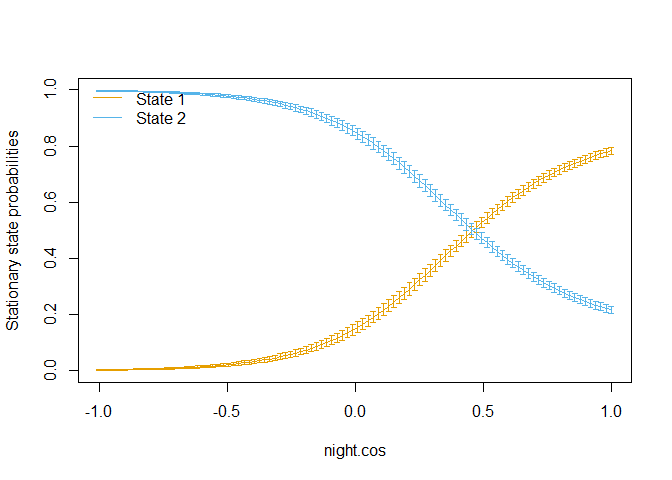<!-- -->

``` r
# Modify function to extract plot data
fnc.plot <- function (m, col = NULL, plotCI = TRUE, alpha = 0.95) {
  # if (!is.moveHMM(m)) 
  #   stop("'m' must be a moveHMM object (as output by fitHMM)")
  data <- m$data
  nbStates <- ncol(m$mle$stepPar)
  beta <- m$mle$beta
  if (nrow(beta) == 1) 
    stop("No covariate effect to plot (nrow(beta)==1).")
  if (!is.null(col) & length(col) != nbStates) {
    warning("Length of 'col' should be equal to number of states - argument ignored")
    col <- NULL
  }
  if (is.null(col) & nbStates < 8) {
    pal <- c("#E69F00", "#56B4E9", "#009E73", 
             "#F0E442", "#0072B2", "#D55E00", 
             "#CC79A7")
    col <- pal[1:nbStates]
  }
  if (is.null(col) & nbStates >= 8) {
    hues <- seq(15, 375, length = nbStates + 1)
    col <- hcl(h = hues, l = 65, c = 100)[1:nbStates]
  }
  get_stat <- function(beta, covs, nbStates, i) {
    gamma <- moveHMM:::trMatrix_rcpp(nbStates, beta, covs)[, , 1]
    solve(t(diag(nbStates) - gamma + 1), rep(1, nbStates))[i]
  }
  rawCovs <- m$rawCovs
  gridLength <- 100
  quantSup <- qnorm(1 - (1 - alpha)/2)
  for (cov in 1:ncol(rawCovs)) {
    inf <- min(rawCovs[, cov], na.rm = TRUE)
    sup <- max(rawCovs[, cov], na.rm = TRUE)
    meanCovs <- colMeans(rawCovs)
    tempCovs <- data.frame(rep(meanCovs[1], gridLength))
    if (length(meanCovs) > 1) 
      for (i in 2:length(meanCovs)) tempCovs <- cbind(tempCovs, 
                                                      rep(meanCovs[i], gridLength))
    tempCovs[, cov] <- seq(inf, sup, length = gridLength)
    colnames(tempCovs) <- colnames(rawCovs)
    desMat <- model.matrix(m$conditions$formula, data = tempCovs)
    probs <- stationary(m, covs = desMat)
    plot(tempCovs[, cov], probs[, 1], type = "l", ylim = c(0, 
                                                           1), col = col[1], xlab = names(rawCovs)[cov], ylab = "Stationary state probabilities")
    for (state in 2:nbStates) points(tempCovs[, cov], probs[, 
                                                            state], type = "l", col = col[state])
    legend("topleft", legend = paste("State", 
                                     1:nbStates), col = col, lty = 1, bty = "n")
    if (plotCI) {
      Sigma <- ginv(m$mod$hessian)
      i1 <- length(m$mle$stepPar) + length(m$mle$anglePar) - 
        (!m$conditions$estAngleMean) * nbStates + 1
      i2 <- i1 + length(m$mle$beta) - 1
      gamInd <- i1:i2
      lci <- matrix(NA, gridLength, nbStates)
      uci <- matrix(NA, gridLength, nbStates)
      for (state in 1:nbStates) {
        dN <- t(apply(desMat, 1, function(x) numDeriv::grad(get_stat, 
                                                            beta, covs = matrix(x, nrow = 1), nbStates = nbStates, 
                                                            i = state)))
        se <- t(apply(dN, 1, function(x) suppressWarnings(sqrt(x %*% 
                                                                 Sigma[gamInd, gamInd] %*% x))))
        lci[, state] <- plogis(qlogis(probs[, state]) - 
                                 quantSup * se/(probs[, state] - probs[, state]^2))
        uci[, state] <- plogis(qlogis(probs[, state]) + 
                                 quantSup * se/(probs[, state] - probs[, state]^2))
        options(warn = -1)
        arrows(tempCovs[, cov], lci[, state], tempCovs[, 
                                                       cov], uci[, state], length = 0.025, angle = 90, 
               code = 3, col = col[state], lwd = 0.7)
        options(warn = 1)
      }
    }
  }
  df.list <- list(tempCovs = tempCovs, probs = probs, lci = lci, uci = uci )
  return(df.list)
}


# Practice plot
p <- fnc.plot(m1, plotCI = TRUE)
```

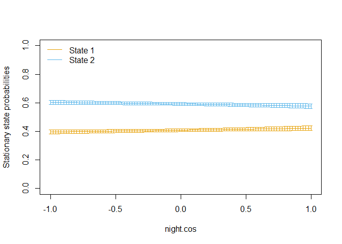<!-- -->

``` r
p1 <- tibble(State = 'Slow', night.cos = p$tempCovs[ ,1], prob = p$probs[ , 1], lcl = p$lci[ , 1], ucl = p$uci[ , 1])
p2 <- tibble(State = 'Fast', night.cos = p$tempCovs[ ,1], prob = p$probs[ , 2], lcl = p$lci[ , 2], ucl = p$uci[ , 2])
p.all <- bind_rows(p1, p2)
ggplot(p.all, aes(night.cos, prob, ymin = lcl, ymax = ucl, group = State, fill = State, col = State)) + 
  geom_ribbon(alpha = 0.5) +
  geom_line()
```

<!-- -->

## 3a. Extract plot data

``` r
plot.list <- vector(mode = 'list', length = nrow(df.species.season))
for (xxx in 1:nrow(df.species.season)){
  print(xxx)
  m1 <- move.list[[xxx]]
  p <- fnc.plot(m1, plotCI = TRUE)
  
  p1 <- tibble(State = 'Slow', night.cos = p$tempCovs[ ,1], prob = p$probs[ , 1], lcl = p$lci[ , 1], ucl = p$uci[ , 1])
  p2 <- tibble(State = 'Fast', night.cos = p$tempCovs[ ,1], prob = p$probs[ , 2], lcl = p$lci[ , 2], ucl = p$uci[ , 2])
  p.all <- bind_rows(p1, p2)
  p.all <- p.all %>% mutate(Species = df.species.season$species[xxx], Season = df.species.season$season[xxx], .before = State)
  plot.list[[xxx]] <- p.all
}
```

    ## [1] 1

<!-- -->

    ## [1] 2

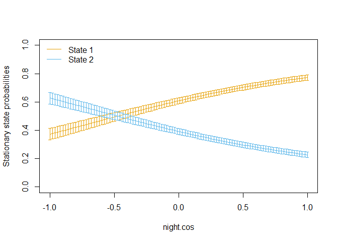<!-- -->

    ## [1] 3

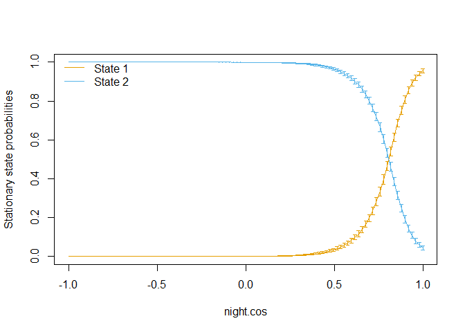<!-- -->

    ## [1] 4

<!-- -->

    ## [1] 5

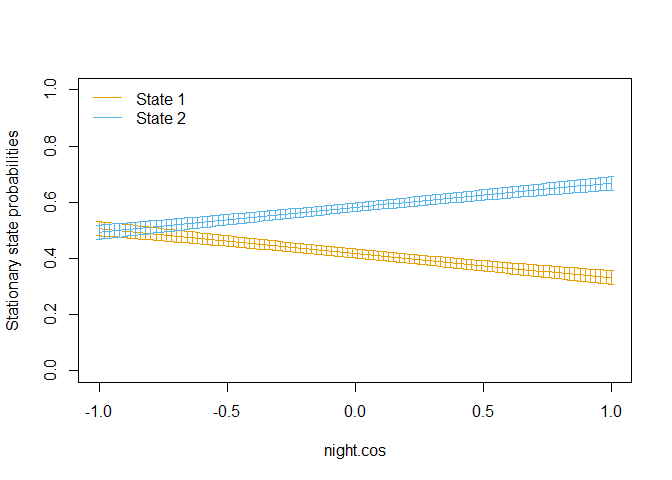<!-- -->

    ## [1] 6

<!-- -->

    ## [1] 7

<!-- -->

``` r
df.plot <- bind_rows(plot.list)
df.plot <- df.plot %>% mutate(Hour = acos(night.cos) * 24 / (2*pi)) %>% 
  mutate(Season = factor(Season, levels = c('Spring', 'Summer', 'Fall', 'Winter')))

a1 <- df.plot  # morning hours
a2 <- df.plot %>% mutate(Hour = 24 - Hour) # Afternoon hours
a <- bind_rows(a1, a2)

ggplot(a, aes(Hour, prob, ymin = lcl, ymax = ucl, group = State, fill = State, col = State)) + 
  theme_bw() +
  facet_grid(Species ~ Season) +
  geom_ribbon(alpha = 0.4, outline.type = 'both', linetype = 0) +
  geom_line() +
  scale_fill_lancet() +
  scale_color_lancet() +
  scale_x_continuous(breaks = c(0, 12, 24)) + #, labels = c('Noon', 'Midnight')) +
  xlab('Hour of day') +
  ylab('Stationary state probability') +
  theme(panel.grid = element_blank(), axis.text = element_text(colour = 'black')) #, axis.text.x = element_text(angle = 90, hjust = 1, vjust = 0.5))
```

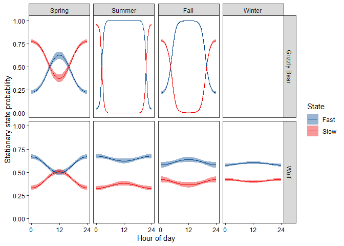<!-- -->

``` r
ggsave('Output/Fig. S1. State probability vs night.png', width = 6, height = 5, scale = 0.9)
```
